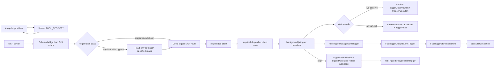

# Phase 18: Shared Tool Registry & Dispatcher Wiring - Research

**Researched:** 2026-06-16
**Domain:** Shared tool registry, MCP dispatcher wiring, background-owned trigger lifecycle
**Confidence:** HIGH

<user_constraints>
## User Constraints (from CONTEXT.md)

### Locked Decisions

### Shared Registry & Schema Parity

- **D-01:** Add all four trigger tools to the shared `TOOL_REGISTRY` in `extension/ai/tool-definitions.js` and mirror the file byte-identically to `mcp/ai/tool-definitions.cjs`. Do not create a separate MCP-only or autopilot-only trigger schema stack.
- **D-02:** Existing tool definitions and schemas stay byte-identical; the trigger family is purely additive. Phase 18 must update schema/parity tests so `tests/tool-definitions-parity.test.js`, existing schema-lock coverage, and MCP route-contract coverage fail if the trigger tools drift, replace existing fields, or lack routes.
- **D-03:** `trigger` is a side-effecting background-routed tool that arms a persisted watcher through existing trigger runtime seams. It should start/own the watcher in `background.js` and return a bounded arm result (`success`/`trigger_id`/initial status) for Phase 18. Any extended blocking wait, heartbeat loop, auto-detach, or structured fire/timeout envelope is Phase 19.

### Queue Bypass & Deadlock Prevention

- **D-04:** `stop_trigger`, `get_trigger_status`, and `list_triggers` must bypass the single-slot mutation queue even while `trigger` or future blocking trigger reporting is outstanding. Do not register these companions through the ordinary manual action path if that would require visual-session fields or enqueue behind mutation tools.
- **D-05:** `stop_trigger` is semantically side-effecting but cancellation-critical. Treat it like `stop_task` for scheduling: it must be callable promptly, must not wait behind the trigger it cancels, and must return idempotently when the trigger is already terminal or missing.
- **D-06:** `get_trigger_status` and `list_triggers` are status/query tools backed by persisted trigger snapshots. They should be in the queue-bypass/read-only class and should not require visual-session fields.

### Dispatcher & Background Ownership

- **D-07:** Registry exposure is not enough. Add explicit MCP direct route contracts in `extension/ws/mcp-tool-dispatcher.js` for the four trigger tools, and route them to background/service-worker trigger handlers. A background-routed registry tool without a `hasMcpToolRoute()` route is a bug.
- **D-08:** The long-running watcher always lives in `background.js` and the trigger runtime modules, not inside an MCP server handler or the MCP single-slot queue. The MCP server/dispatcher should send an arm/stop/status/list message and receive a bounded response; it must not own `MutationObserver`, refresh-poll alarms, lifecycle fire decisions, or trigger storage.
- **D-09:** Reuse the existing trigger runtime seams. Arming delegates to `FsbTriggerManager.armTrigger(spec)`. Stop/status/list read and mutate `FsbTriggerStore` / `FsbTriggerLifecycle` state. Fire/no-fire decisions remain owned by `FsbTriggerLifecycle.handleTriggerAlarm()` and `FsbTriggerManager.evaluate()`.

### Stop, Status & List Semantics

- **D-10:** `stop_trigger` orchestration should read the persisted snapshot first, stop any content-side observer/pulse for that trigger (`triggerObserveStop` / `triggerPulseStop`) when a target tab is known, clear the live-observe watchdog if present, then clear the persisted snapshot/alarm via `FsbTriggerLifecycle.clearTrigger(trigger_id)`. Missing or already terminal triggers return a successful idempotent outcome rather than throwing.
- **D-11:** `get_trigger_status` returns from the storage-of-truth snapshot, not SW heap or `activeSessions`. Include at minimum: `trigger_id`, `status`, `watch`, `condition`, `target_tab_id`, `agent_id`, baseline/initial value, current/last/reported value, `armed_at`, elapsed, remaining TTL when calculable, `last_evaluated_at`, `last_reported_at`, and attention details (`attention_reason`, `last_attention`, blocked/not-found codes) when present.
- **D-12:** `list_triggers` enumerates the persisted trigger registry and returns compact trigger summaries for active and attention states by default. Include age, owner, watch mode, status, tab id, last-check/report timestamps, and remaining TTL. Do not synthesize state from alarm names alone.
- **D-13:** Ownership remains agent-scoped. `trigger` must bind the trigger snapshot to the calling `agent_id`, `target_tab_id`, and ownership token where available. Companion tools must reject cross-agent stop/status/list access using the same ownership semantics already used by refresh-poll and MCP tab dispatch, while preserving legacy behavior only where existing MCP agent-scope contracts require it.

### Tests & Verification

- **D-14:** Add focused Node/source tests for: tool definition parity, trigger schema additivity, all four direct MCP route contracts, companion bypass behavior while a mutation/trigger queue item is running, stop idempotency and observer/pulse cleanup call shape, status/list projection from persisted snapshots, and provider/autopilot visibility from the shared registry.
- **D-15:** Do not require live-browser UAT for Phase 18 beyond existing deferred milestone debt. This phase is primarily registry/dispatcher/storage orchestration and should be verifiable with Node tests plus source-contract checks.

### Claude's Discretion

- Exact trigger input schema details, as long as it supports one uniqueness-scored selector, one target tab, watch mode, extraction options, and the Phase 15 condition contract without inventing multi-element compound conditions.
- Exact implementation split for trigger background handlers: extend `background.js` near existing trigger helpers or extract a small helper module, as long as import/order and MV3 service-worker constraints remain coherent.
- Exact MCP server registration mechanism for queue-bypass companions, as long as the tools are still defined once in the shared registry and companions do not go through the ordinary queued manual action path.
- Exact status/list response field names beyond the minimum fields above, as long as the output remains compact, structured, and stable enough for MCP clients and autopilot to consume.

### Deferred Ideas (OUT OF SCOPE)

- Blocking-by-default `trigger()` wait loop, heartbeats, auto-convert-to-detached, detached TTL/reconnect grace, and structured fire/timeout event envelope -- Phase 19.
- Trigger cap UI, docs, CHANGELOG/README, version bump, co-located watch-mode conflict handling, and reload coalescing -- Phase 20.
- Cross-browser-restart trigger auto-resume via `chrome.storage.local` -- future SURV-FUTURE-01, out of v0.11 scope.
- Auto-act-on-fire, desktop/push/email/Slack notifications, and multi-element compound trigger conditions -- explicitly future scope in requirements.
</user_constraints>

<phase_requirements>
## Phase Requirements

| ID | Description | Research Support |
|----|-------------|------------------|
| TRIG-01 | User can arm a trigger on one targeted DOM element via uniqueness-scored selector by specifying a fire condition. | Use one `trigger` registry tool routed to `background.js`; read baseline through the content `triggerRead` path, delegate validation/cap/snapshot creation to `FsbTriggerManager.armTrigger(spec)`, then start live-observe or refresh-poll background watcher. [VERIFIED: .planning/REQUIREMENTS.md; extension/content/messaging.js; extension/utils/trigger-manager.js; extension/background.js] |
| REG-01 | Four tools registered once in shared registry and exposed to autopilot and MCP. | Add `trigger`, `stop_trigger`, `get_trigger_status`, and `list_triggers` only to `extension/ai/tool-definitions.js`; keep `mcp/ai/tool-definitions.cjs` as the byte-identical mirror consumed by MCP schema bridge and autopilot/provider formatting. [VERIFIED: extension/ai/tool-definitions.js; mcp/ai/tool-definitions.cjs; mcp/src/tools/schema-bridge.ts; extension/ai/agent-loop.js] |
| REG-02 | Companions in MCP read-only bypass; watcher in `background.js`, not MCP handler, so blocking trigger never starves queue/deadlocks `stop_trigger`. | Mark companions as registry read-only/bypass tools, register them outside ordinary manual action validation, and keep watcher ownership in background trigger helpers/lifecycle modules. [VERIFIED: mcp/src/queue.ts; mcp/src/tools/manual.ts; mcp/src/tools/read-only.ts; extension/background.js; extension/utils/trigger-lifecycle.js] |
| REG-03 | Existing MCP schemas byte-identical; trigger family additive; schema-lock green. | Extend parity/schema-lock tests so existing names remain unchanged, the CJS mirror stays byte-identical, and trigger additions do not mutate existing tool contracts. [VERIFIED: tests/tool-definitions-parity.test.js; tests/visual-session-schema-lock.test.js; mcp/package.json] |
| REG-04 | Trigger tools behave identically across all 7 AI providers when driven by autopilot. | Autopilot public tool exposure is generated from the shared registry and provider-specific formatting is centralized, so provider parity should be tested from registry output rather than per-provider hand-written trigger schemas. [VERIFIED: extension/ai/agent-loop.js; extension/ai/tool-use-adapter.js] |
| LIFE-01 | Stop active trigger tears down observer/cancels poll alarm/clears pulse. | `stop_trigger` should read snapshot, send `triggerObserveStop`/`triggerPulseStop` where a tab exists, clear live-observe watchdog, then call `FsbTriggerLifecycle.clearTrigger(trigger_id)`. [VERIFIED: extension/background.js; extension/content/messaging.js; extension/utils/trigger-lifecycle.js] |
| LIFE-02 | Get status state/current vs initial/condition/watch/elapsed/remaining/last-check. | Project status from persisted snapshots, using baseline/last/reported/timestamps/deadline fields already written by manager/lifecycle/value-report paths. [VERIFIED: extension/utils/trigger-store.js; extension/utils/trigger-manager.js; extension/utils/trigger-lifecycle.js; extension/background.js] |
| LIFE-03 | List all active triggers. | Enumerate persisted trigger registry through `FsbTriggerStore.hydrate()`/snapshot helpers and default to active plus attention states, not alarm-name reconstruction. [VERIFIED: extension/utils/trigger-store.js; .planning/phases/18-shared-tool-registry-dispatcher-wiring/18-CONTEXT.md] |
</phase_requirements>

## Summary

Phase 18 is an in-tree wiring phase, not a new-library phase. The shared registry already drives autopilot exposure, MCP schema bridging, route metadata, and read-only classification; the trigger family must join that registry once and keep the MCP `.cjs` mirror byte-identical. [VERIFIED: extension/ai/tool-definitions.js; mcp/ai/tool-definitions.cjs; mcp/src/tools/schema-bridge.ts; extension/ai/agent-loop.js]

The critical planning issue is scheduling classification. `stop_trigger` changes state, but it must be treated as cancellation-critical and queue-bypassing; `get_trigger_status` and `list_triggers` are also snapshot-backed bypass tools. The existing `TaskQueue` bypasses names derived from registry read-only tools, while `manual.ts` registers non-read-only tools through visual-session validation and queue serialization, so companion tools must not enter the ordinary manual action path. [VERIFIED: mcp/src/queue.ts; mcp/src/tools/manual.ts; mcp/src/tools/read-only.ts; .planning/phases/18-shared-tool-registry-dispatcher-wiring/18-CONTEXT.md]

The watcher must live in `background.js` and the trigger runtime modules. Existing background helpers already start/stop content observers, send pulse messages, handle refresh-poll alarms, process live value reports, and clear lifecycle alarms/snapshots, so Phase 18 should expose bounded arm/stop/status/list handlers that reuse those seams instead of rebuilding trigger state management. [VERIFIED: extension/background.js; extension/utils/trigger-store.js; extension/utils/trigger-manager.js; extension/utils/trigger-lifecycle.js; extension/content/messaging.js]

**Primary recommendation:** add the four trigger definitions once to the shared registry, route all four through explicit MCP dispatcher contracts, classify companions as queue-bypassing registry tools, and implement bounded background handlers that delegate to `FsbTriggerManager`, `FsbTriggerStore`, and `FsbTriggerLifecycle`. [VERIFIED: extension/ai/tool-definitions.js; extension/ws/mcp-tool-dispatcher.js; mcp/src/queue.ts; extension/utils/trigger-manager.js; extension/utils/trigger-store.js; extension/utils/trigger-lifecycle.js]

## Architectural Responsibility Map

| Capability | Primary Tier | Secondary Tier | Rationale |
|------------|--------------|----------------|-----------|
| Shared trigger tool definitions | Shared extension/MCP registry | MCP schema bridge | `TOOL_REGISTRY` is the canonical source and MCP imports the CJS mirror through schema bridge. [VERIFIED: extension/ai/tool-definitions.js; mcp/src/tools/schema-bridge.ts] |
| Autopilot provider visibility | Browser extension autopilot | Provider formatting adapter | Autopilot derives public tools from the registry and formats provider-specific tool shapes centrally. [VERIFIED: extension/ai/agent-loop.js; extension/ai/tool-use-adapter.js] |
| MCP tool registration and bypass | MCP server | TaskQueue/read-only modules | MCP registration decides whether a call goes through manual queue serialization or read-only bypass. [VERIFIED: mcp/src/runtime.ts; mcp/src/tools/manual.ts; mcp/src/tools/read-only.ts; mcp/src/queue.ts] |
| Direct MCP route contracts | Extension websocket dispatcher | MCP bridge client | Background-routed registry tools need `hasMcpToolRoute()` coverage or the bridge returns `mcp_route_unavailable`. [VERIFIED: extension/ws/mcp-tool-dispatcher.js; extension/ws/mcp-bridge-client.js] |
| Trigger watcher runtime | Background service worker | Content script observer/read/pulse | Background owns lifecycle, alarms, refresh-poll reloads, observer watchdogs, and content messages; content only reads/observes/pulses the DOM. [VERIFIED: extension/background.js; extension/content/messaging.js; extension/content/trigger-observe.js] |
| Trigger persistence/status/list | Extension storage utilities | Background projection handlers | Trigger store is the persisted registry and lifecycle writes status/timestamps; status/list should project from that storage. [VERIFIED: extension/utils/trigger-store.js; extension/utils/trigger-lifecycle.js] |
| Agent ownership enforcement | Background agent registry | MCP bridge scoped message metadata | Agent tab ownership and ownership tokens exist in the registry/bridge path and refresh-poll code already checks them. [VERIFIED: extension/utils/agent-registry.js; mcp/src/agent-bridge.ts; extension/background.js] |

## Project Constraints

- No `AGENTS.md` or `CLAUDE.md` exists at the workspace root, so there are no additional project-local agent directives beyond `.planning` artifacts. [VERIFIED: `test -f AGENTS.md`; `test -f CLAUDE.md`]
- No `.claude/skills/` or `.agents/skills/` project skill directories exist in this workspace. [VERIFIED: `find .claude/skills .agents/skills`]
- `.planning/config.json` has `commit_docs: true`, so the research artifact should be committed after writing. [VERIFIED: .planning/config.json]
- `.planning/config.json` does not set `workflow.nyquist_validation` to `false`, so Validation Architecture is required. [VERIFIED: .planning/config.json]
- `.planning/config.json` does not set `security_enforcement` to `false`, so Security Domain is required. [VERIFIED: .planning/config.json]
- `.planning/graphs/graph.json` is absent, so no graph context is available for this phase. [VERIFIED: `ls .planning/graphs/graph.json`]

## Standard Stack

### Core

| Library / Module | Version | Purpose | Why Standard |
|------------------|---------|---------|--------------|
| Shared `TOOL_REGISTRY` | in-tree | Canonical tool definitions, route metadata, read-only metadata, and registry helpers. | Existing extension and MCP code already consume this registry and tests already assert mirror parity. [VERIFIED: extension/ai/tool-definitions.js; tests/tool-definitions-parity.test.js] |
| `mcp/ai/tool-definitions.cjs` mirror | in-tree | MCP-compatible copy of the registry file. | `mcp/package.json` build copies the extension registry into the MCP mirror, preserving byte identity. [VERIFIED: mcp/package.json; mcp/ai/tool-definitions.cjs] |
| `mcp/src/tools/schema-bridge.ts` | in-tree | Converts shared JSON Schemas into Zod schemas for MCP registration. | MCP runtime imports registry definitions through this bridge instead of duplicating tool schemas. [VERIFIED: mcp/src/tools/schema-bridge.ts] |
| `mcp/src/queue.ts` | in-tree | Single-slot mutation queue plus read-only bypass. | Existing queue bypass derives from registry read-only tools and bypasses `enqueue()` immediately for those names. [VERIFIED: mcp/src/queue.ts] |
| `extension/ws/mcp-tool-dispatcher.js` | in-tree | Direct MCP route contracts and bridge dispatch into background handlers. | Existing background-routed registry tools require explicit route contracts and dispatcher handlers. [VERIFIED: extension/ws/mcp-tool-dispatcher.js; tests/mcp-tool-routing-contract.test.js] |
| `FsbTriggerManager` / `FsbTriggerStore` / `FsbTriggerLifecycle` | in-tree | Trigger validation, persisted snapshots, alarms, state transitions, and cleanup. | Prior trigger phases already implemented these runtime seams and Phase 18 context locks reuse. [VERIFIED: extension/utils/trigger-manager.js; extension/utils/trigger-store.js; extension/utils/trigger-lifecycle.js; .planning/phases/18-shared-tool-registry-dispatcher-wiring/18-CONTEXT.md] |
| `background.js` trigger helpers | in-tree | Start/stop observers, pulses, watchdogs, refresh-poll reads, value reports, and alarm branches. | Existing service-worker helper paths are the correct owner for long-running watcher behavior. [VERIFIED: extension/background.js] |

### Supporting

| Library / Module | Version | Purpose | When to Use |
|------------------|---------|---------|-------------|
| `@modelcontextprotocol/sdk` | `^1.29.0` | MCP server tool registration runtime. | Use existing MCP server registration APIs; do not introduce a second MCP framework. [VERIFIED: mcp/package.json] |
| `zod` | `^3.24.0` | MCP input schemas after JSON Schema conversion. | Use through `schema-bridge.ts`; do not hand-author separate Zod trigger schemas. [VERIFIED: mcp/package.json; mcp/src/tools/schema-bridge.ts] |
| TypeScript | `^5.9.3` | MCP source build. | Run MCP build/typecheck after registration changes. [VERIFIED: mcp/package.json] |
| Node.js | `v24.14.1` available locally | Test runner for existing Node tests. | Use existing `npm test` / focused `node tests/*.test.js` commands. [VERIFIED: `node --version`; package.json] |
| npm | `11.11.0` available locally | Package scripts and MCP build. | Use existing package scripts; no new install is needed. [VERIFIED: `npm --version`; package.json; mcp/package.json] |

### Alternatives Considered

| Instead of | Could Use | Tradeoff |
|------------|-----------|----------|
| Shared registry trigger definitions | MCP-only trigger schema definitions | Rejected because locked decisions require one shared schema stack and byte-identical extension/MCP definitions. [VERIFIED: .planning/phases/18-shared-tool-registry-dispatcher-wiring/18-CONTEXT.md] |
| Background-owned watcher | MCP handler-owned blocking watcher | Rejected because locked decisions require watcher state, alarms, observer ownership, and lifecycle decisions in `background.js`/runtime modules. [VERIFIED: .planning/phases/18-shared-tool-registry-dispatcher-wiring/18-CONTEXT.md; extension/background.js] |
| Companion tools through manual action queue | Registry read-only/bypass classification plus direct message routes | Rejected because `manual.ts` validates visual fields and enqueues non-read-only tools, which would starve cancellation/status behind mutations. [VERIFIED: mcp/src/tools/manual.ts; mcp/src/queue.ts] |
| New trigger storage abstraction | `FsbTriggerStore` / `FsbTriggerLifecycle` | Rejected because existing store/lifecycle already own snapshots and alarm cleanup. [VERIFIED: extension/utils/trigger-store.js; extension/utils/trigger-lifecycle.js] |

**Installation:** no new npm packages are recommended for Phase 18. [VERIFIED: package.json; mcp/package.json]

```bash
# No package installation required.
```

**Version verification:** package versions above are from in-repo `package.json` files, and local runtime availability was checked with `node --version` and `npm --version`; no new registry package version needs `npm view` verification because the recommended stack is entirely in-tree. [VERIFIED: package.json; mcp/package.json; `node --version`; `npm --version`]

## Architecture Patterns

### System Architecture Diagram



The primary data flow is registry exposure to MCP/autopilot, bounded dispatch to `background.js`, then runtime ownership by trigger manager/lifecycle/store and content observer/read/pulse helpers. [VERIFIED: extension/ai/tool-definitions.js; mcp/src/tools/schema-bridge.ts; extension/ws/mcp-bridge-client.js; extension/ws/mcp-tool-dispatcher.js; extension/background.js; extension/utils/trigger-manager.js; extension/utils/trigger-lifecycle.js; extension/utils/trigger-store.js; extension/content/messaging.js]

### Recommended Project Structure

```text
extension/
├── ai/
│   └── tool-definitions.js          # Add four trigger definitions once.
├── ws/
│   ├── mcp-tool-dispatcher.js       # Add four direct route contracts/handlers.
│   └── mcp-bridge-client.js         # Add direct message cases if new message types are used.
├── utils/
│   ├── trigger-store.js             # Existing persisted registry.
│   ├── trigger-manager.js           # Existing arm/evaluate/cap logic.
│   └── trigger-lifecycle.js         # Existing alarm/state/clear logic.
└── background.js                    # Add bounded arm/stop/status/list handlers near trigger helpers.

mcp/
├── ai/
│   └── tool-definitions.cjs         # Byte-identical mirror from build/copy.
└── src/
    ├── tools/
    │   ├── read-only.ts             # Register companion bypass tools or delegate to trigger-specific registrar.
    │   ├── manual.ts                # Exclude trigger family if a trigger-specific registrar owns them.
    │   └── triggers.ts              # Recommended small registrar for trigger family direct messages. [ASSUMED]
    └── queue.ts                     # Existing bypass behavior should remain source of truth.

tests/
├── tool-definitions-parity.test.js
├── visual-session-schema-lock.test.js
├── mcp-tool-routing-contract.test.js
├── mcp-tool-smoke.test.js
└── trigger-*-test.js
```

The only proposed new file is a small MCP trigger registrar if the planner chooses to keep `trigger` itself out of ordinary visual-session/manual registration; companion tools can also be registered by extending `read-only.ts` if duplicate registration is avoided. [ASSUMED]

### Pattern 1: Registry-First Tool Addition

**What:** define the four public trigger tools once in `extension/ai/tool-definitions.js`, preserve internal metadata (`_route`, `_readOnly`, verbs), and mirror to `mcp/ai/tool-definitions.cjs`. [VERIFIED: extension/ai/tool-definitions.js; mcp/ai/tool-definitions.cjs; mcp/package.json]

**When to use:** every trigger tool exposed to autopilot or MCP must use this pattern because both surfaces already consume the shared registry. [VERIFIED: extension/ai/agent-loop.js; mcp/src/tools/schema-bridge.ts]

**Recommended shape:**

```javascript
// Source: extension/ai/tool-definitions.js registry pattern.
{
  name: 'stop_trigger',
  description: 'Stop an active DOM trigger and clear its observer, pulse, alarm, and persisted snapshot.',
  input_schema: {
    type: 'object',
    properties: {
      trigger_id: { type: 'string', description: 'Trigger id returned by trigger().' }
    },
    required: ['trigger_id']
  },
  _route: 'background',
  _readOnly: true,
  _contentVerb: null,
  _cdpVerb: null,
  _emitChangeReport: false
}
```

`stop_trigger` should be marked `_readOnly: true` for scheduling even though its runtime handler mutates trigger state, because the queue bypass is name/classification based and cancellation must not wait behind the target trigger. [VERIFIED: mcp/src/queue.ts; .planning/phases/18-shared-tool-registry-dispatcher-wiring/18-CONTEXT.md]

### Pattern 2: Companion Queue Bypass

**What:** `stop_trigger`, `get_trigger_status`, and `list_triggers` must register in MCP through a bypass path, not through `manual.ts`. [VERIFIED: mcp/src/tools/manual.ts; mcp/src/tools/read-only.ts; mcp/src/queue.ts]

**When to use:** any cancellation/status/list tool that must return while a mutation or future blocking trigger is outstanding. [VERIFIED: .planning/phases/18-shared-tool-registry-dispatcher-wiring/18-CONTEXT.md]

**Implementation guidance:** add companion names to the read-only registration message map or a trigger-specific registrar, and add focused tests showing a pending queued mutation does not delay `stop_trigger`. [VERIFIED: mcp/src/tools/read-only.ts; mcp/src/queue.ts; tests/mcp-tool-smoke.test.js]

### Pattern 3: Direct MCP Route Contract for Every Background Trigger Tool

**What:** every trigger tool with `_route: 'background'` needs a direct route in `extension/ws/mcp-tool-dispatcher.js`. [VERIFIED: extension/ws/mcp-tool-dispatcher.js; extension/ws/mcp-bridge-client.js; tests/mcp-tool-routing-contract.test.js]

**When to use:** all four Phase 18 tools, because registry exposure alone does not make `mcp-bridge-client.js` dispatch background-routed calls. [VERIFIED: extension/ws/mcp-bridge-client.js; .planning/phases/18-shared-tool-registry-dispatcher-wiring/18-CONTEXT.md]

**Example route pattern:**

```javascript
// Source: extension/ws/mcp-tool-dispatcher.js route-table pattern.
const MCP_PHASE199_TOOL_ROUTES = {
  // ...
  trigger: {
    messageType: 'mcp:trigger',
    handler: handleTriggerRoute
  },
  stop_trigger: {
    messageType: 'mcp:stop-trigger',
    handler: handleStopTriggerRoute
  }
};
```

The route handlers should call bounded background trigger functions and return tool-shaped JSON without owning the watcher loop. [VERIFIED: extension/ws/mcp-tool-dispatcher.js; extension/background.js]

### Pattern 4: Background Handler as Thin Orchestrator

**What:** background handlers should validate ownership/input, call existing trigger runtime seams, and project response envelopes. [VERIFIED: extension/background.js; extension/utils/trigger-manager.js; extension/utils/trigger-store.js; extension/utils/trigger-lifecycle.js]

**When to use:** `trigger`, `stop_trigger`, `get_trigger_status`, and `list_triggers`, because lifecycle decisions, storage, and alarms already exist. [VERIFIED: extension/utils/trigger-manager.js; extension/utils/trigger-lifecycle.js]

**Recommended handler outline:**

```javascript
// Source: existing background trigger helper/lifecycle patterns.
async function fsbTriggerHandleStopTool(params, routeContext) {
  const triggerId = params.trigger_id;
  const snapshot = await FsbTriggerStore.readSnapshot(triggerId);
  if (!snapshot || snapshot.status !== 'armed') {
    return { success: true, trigger_id: triggerId, stopped: false, status: snapshot?.status || 'missing' };
  }

  await fsbTriggerAssertTriggerOwnership(snapshot, routeContext);
  await fsbTriggerStopObserveForSnapshot(snapshot);
  fsbTriggerClearObserveWatchdog(triggerId);
  await FsbTriggerLifecycle.clearTrigger(triggerId);

  return { success: true, trigger_id: triggerId, stopped: true };
}
```

`fsbTriggerStopObserveForSnapshot()` already sends content stop messages for observer and pulse, while `FsbTriggerLifecycle.clearTrigger()` clears the persisted snapshot and trigger alarm. [VERIFIED: extension/background.js; extension/utils/trigger-lifecycle.js]

### Anti-Patterns to Avoid

- **Duplicating trigger schemas in MCP:** separate MCP trigger schemas would violate shared-registry and byte-identity decisions. [VERIFIED: .planning/phases/18-shared-tool-registry-dispatcher-wiring/18-CONTEXT.md]
- **Registering companions through `manual.ts`:** `manual.ts` validates visual fields and enqueues non-read-only tools, which conflicts with cancellation/status bypass requirements. [VERIFIED: mcp/src/tools/manual.ts; mcp/src/queue.ts]
- **Letting MCP own watcher loops:** MCP handlers should return bounded responses; background/lifecycle modules already own alarms, observer restarts, value reports, and state transitions. [VERIFIED: extension/background.js; extension/utils/trigger-lifecycle.js]
- **Synthesizing status from alarms:** trigger status/list must project persisted snapshots because alarm names are not full state. [VERIFIED: extension/utils/trigger-store.js; .planning/phases/18-shared-tool-registry-dispatcher-wiring/18-CONTEXT.md]
- **Skipping direct route tests:** `mcp-bridge-client.js` rejects background-routed tools without `hasMcpToolRoute()` coverage. [VERIFIED: extension/ws/mcp-bridge-client.js; tests/mcp-tool-routing-contract.test.js]

## Don't Hand-Roll

| Problem | Don't Build | Use Instead | Why |
|---------|-------------|-------------|-----|
| Tool schema registry | Separate MCP/autopilot trigger schema tables | Shared `TOOL_REGISTRY` plus CJS mirror | Existing parity and provider exposure depend on one registry. [VERIFIED: extension/ai/tool-definitions.js; mcp/ai/tool-definitions.cjs; extension/ai/agent-loop.js] |
| MCP input schema conversion | Hand-written Zod trigger schemas | `schema-bridge.ts` conversion from registry JSON Schema | MCP already imports and converts registry schemas. [VERIFIED: mcp/src/tools/schema-bridge.ts] |
| Queue bypass logic | New side-channel queue | Existing `TaskQueue` read-only bypass or a trigger-specific direct registrar | Queue already bypasses registry read-only names immediately. [VERIFIED: mcp/src/queue.ts] |
| Trigger storage/status | In-memory SW maps or alarm-name parsing | `FsbTriggerStore` persisted snapshots | Store is the storage-of-truth surface for status/list. [VERIFIED: extension/utils/trigger-store.js] |
| Fire-condition evaluation | Inline condition checks inside dispatch handlers | `FsbTriggerManager.evaluate()` through lifecycle alarm/value-report paths | Existing lifecycle owns fire/no-fire write-back. [VERIFIED: extension/utils/trigger-manager.js; extension/utils/trigger-lifecycle.js] |
| Observer/pulse lifecycle | New content messages | Existing `triggerObserveStart/Stop`, `triggerRead`, `triggerPulseStart/Stop` | Content script routes and background helpers already implement these operations. [VERIFIED: extension/content/messaging.js; extension/background.js] |
| Ownership model | New trigger-specific auth scheme | Existing agent registry, ownership token, and scoped bridge metadata | Agent registry and bridge already pass/check `agentId`, `ownershipToken`, and tab ownership. [VERIFIED: extension/utils/agent-registry.js; mcp/src/agent-bridge.ts; extension/background.js] |

**Key insight:** this phase is dangerous only if it introduces a second truth source; the correct implementation is thin registry/route/background glue over existing store, manager, lifecycle, dispatcher, and queue primitives. [VERIFIED: .planning/phases/18-shared-tool-registry-dispatcher-wiring/18-CONTEXT.md; extension/utils/trigger-store.js; extension/utils/trigger-manager.js; extension/utils/trigger-lifecycle.js; mcp/src/queue.ts]

## Common Pitfalls

### Pitfall 1: Marking `stop_trigger` as an Ordinary Mutation

**What goes wrong:** `stop_trigger` waits behind the exact blocking trigger or mutation it is supposed to cancel. [VERIFIED: .planning/phases/18-shared-tool-registry-dispatcher-wiring/18-CONTEXT.md; mcp/src/queue.ts]

**Why it happens:** `manual.ts` registers non-read-only tools, requires visual-session fields, and enqueues calls through `TaskQueue`. [VERIFIED: mcp/src/tools/manual.ts]

**How to avoid:** classify `stop_trigger` as queue-bypassing in registry/MCP registration and test it against a pending queued mutation. [VERIFIED: mcp/src/queue.ts; .planning/phases/18-shared-tool-registry-dispatcher-wiring/18-CONTEXT.md]

**Warning signs:** `stop_trigger` appears in the non-read-only manual tool set, requires `visual_reason`, or fails while a fake queued task is unresolved. [VERIFIED: mcp/src/tools/manual.ts; tests/visual-session-schema-lock.test.js]

### Pitfall 2: Registry Exposure Without Dispatcher Route

**What goes wrong:** MCP sees a background tool schema but bridge dispatch returns `mcp_route_unavailable`. [VERIFIED: extension/ws/mcp-bridge-client.js]

**Why it happens:** background-routed registry tools require explicit `mcp-tool-dispatcher.js` route contracts. [VERIFIED: extension/ws/mcp-tool-dispatcher.js; tests/mcp-tool-routing-contract.test.js]

**How to avoid:** add route entries and extend route-contract tests for all four trigger tools. [VERIFIED: tests/mcp-tool-routing-contract.test.js]

**Warning signs:** `hasMcpToolRoute('trigger')` or companion names return false. [VERIFIED: extension/ws/mcp-tool-dispatcher.js]

### Pitfall 3: Relying on Schema Bridge for Deep Condition Validation

**What goes wrong:** malformed nested `condition` data can pass MCP schema conversion and fail later in background/runtime code. [VERIFIED: mcp/src/tools/schema-bridge.ts]

**Why it happens:** `jsonSchemaToZod()` handles primitive JSON Schema types and defaults other nested objects to broad `z.any()` behavior. [VERIFIED: mcp/src/tools/schema-bridge.ts]

**How to avoid:** validate trigger condition shape in the background handler and delegate condition semantics to existing manager/evaluator validation paths. [VERIFIED: extension/utils/trigger-manager.js]

**Warning signs:** tests only assert MCP registration but not invalid condition rejection in background handler. [VERIFIED: tests/mcp-tool-smoke.test.js; tests/trigger-manager.test.js]

### Pitfall 4: Stopping Storage but Leaving Content Pulse/Observer Alive

**What goes wrong:** trigger storage/alarm is gone but the page still shows pulse UI or keeps a MutationObserver active. [VERIFIED: extension/content/messaging.js; extension/content/trigger-observe.js]

**Why it happens:** lifecycle `clearTrigger()` clears storage/alarm, while observer/pulse cleanup is a separate content-message path. [VERIFIED: extension/utils/trigger-lifecycle.js; extension/background.js]

**How to avoid:** stop content observer/pulse, clear live-observe watchdog, then call `clearTrigger()`. [VERIFIED: extension/background.js; extension/utils/trigger-lifecycle.js]

**Warning signs:** stop tests assert `clearTrigger()` only and do not assert `triggerObserveStop`/`triggerPulseStop` message shape. [VERIFIED: extension/background.js; tests/trigger-observe-pulse.test.js]

### Pitfall 5: Status/List From SW Heap

**What goes wrong:** status/list disappear or diverge after service-worker restart. [VERIFIED: extension/utils/trigger-store.js; extension/background.js]

**Why it happens:** MV3 service-worker heap is not the storage-of-truth; persisted snapshots are. [VERIFIED: extension/utils/trigger-store.js; .planning/phases/14-trigger-survivability-foundation/14-CONTEXT.md]

**How to avoid:** status/list must read store snapshots and compute elapsed/remaining projections at response time. [VERIFIED: extension/utils/trigger-store.js; .planning/phases/18-shared-tool-registry-dispatcher-wiring/18-CONTEXT.md]

**Warning signs:** implementation reads `activeSessions`, live observer maps, or Chrome alarms as the primary source. [VERIFIED: extension/background.js; .planning/phases/18-shared-tool-registry-dispatcher-wiring/18-CONTEXT.md]

### Pitfall 6: Provider Parity Tested Through One Provider Only

**What goes wrong:** one provider sees the trigger tools but another provider’s tool format drifts. [VERIFIED: extension/ai/tool-use-adapter.js]

**Why it happens:** provider tool envelopes differ even though their definitions are derived from the same registry. [VERIFIED: extension/ai/tool-use-adapter.js]

**How to avoid:** add a provider visibility test that formats the shared registry trigger tools for all supported provider categories. [VERIFIED: extension/ai/agent-loop.js; extension/ai/tool-use-adapter.js]

**Warning signs:** tests only call MCP smoke registration and never inspect autopilot/provider formatted tools. [VERIFIED: tests/mcp-tool-smoke.test.js; extension/ai/agent-loop.js]

## Code Examples

### Queue Bypass Assertion

```javascript
// Source: mcp/src/queue.ts behavior; use in a focused Node test.
const queue = new TaskQueue();
const never = queue.enqueue('click', () => new Promise(() => {}));

const result = await queue.enqueue('stop_trigger', async () => ({ success: true }));
assert.deepEqual(result, { success: true });
void never;
```

This test only works if `stop_trigger` is included in the registry read-only set or the queue’s explicit bypass set. [VERIFIED: mcp/src/queue.ts]

### Status Projection From Snapshot

```javascript
// Source: trigger-store/lifecycle snapshot fields.
function projectTriggerStatus(snapshot, now = Date.now()) {
  const armedAt = Number(snapshot.armed_at || 0);
  const deadlineAt = Number(snapshot.deadline_at || 0);
  return {
    trigger_id: snapshot.trigger_id,
    status: snapshot.status,
    watch: snapshot.watch,
    condition: snapshot.condition,
    target_tab_id: snapshot.target_tab_id,
    agent_id: snapshot.agent_id,
    initial_value: snapshot.baseline,
    current_value: snapshot.reported_value ?? snapshot.last_value ?? snapshot.baseline,
    armed_at: snapshot.armed_at,
    elapsed_ms: armedAt ? Math.max(0, now - armedAt) : null,
    remaining_ms: deadlineAt ? Math.max(0, deadlineAt - now) : null,
    last_evaluated_at: snapshot.last_evaluated_at,
    last_reported_at: snapshot.last_reported_at,
    attention_reason: snapshot.attention_reason,
    last_attention: snapshot.last_attention
  };
}
```

The exact helper name is implementation-specific, but the field source should be the persisted snapshot rather than service-worker heap. [VERIFIED: extension/utils/trigger-store.js; extension/utils/trigger-manager.js; extension/utils/trigger-lifecycle.js; .planning/phases/18-shared-tool-registry-dispatcher-wiring/18-CONTEXT.md]

### Direct Route Contract Test

```javascript
// Source: tests/mcp-tool-routing-contract.test.js route-contract pattern.
for (const name of ['trigger', 'stop_trigger', 'get_trigger_status', 'list_triggers']) {
  assert.equal(hasMcpToolRoute(name), true, `${name} must have a direct MCP route`);
}
```

The existing route-contract test already treats missing background registry routes as a failure pattern; Phase 18 should extend it with explicit trigger family expectations. [VERIFIED: tests/mcp-tool-routing-contract.test.js; extension/ws/mcp-tool-dispatcher.js]

## State of the Art

| Old Approach | Current Approach | When Changed | Impact |
|--------------|------------------|--------------|--------|
| Tool-specific MCP schemas | Shared registry plus CJS mirror | Existing in current tree | Trigger schemas should be added once and mirrored byte-identically. [VERIFIED: extension/ai/tool-definitions.js; mcp/ai/tool-definitions.cjs; tests/tool-definitions-parity.test.js] |
| Queue all MCP calls through one manual path | Split manual mutation path and read-only bypass | Existing in current tree | Companion tools can return while mutation queue is blocked. [VERIFIED: mcp/src/tools/manual.ts; mcp/src/tools/read-only.ts; mcp/src/queue.ts] |
| Handler-owned trigger state | Background-owned trigger store/lifecycle/alarms | Prior trigger phases and current tree | MCP handlers should be bounded message dispatchers, not watcher owners. [VERIFIED: extension/background.js; extension/utils/trigger-store.js; extension/utils/trigger-lifecycle.js] |
| Live-observe only | Live-observe plus refresh-poll watch paths | Prior Phase 17/current tree | `trigger` schema and handlers must support both watch modes. [VERIFIED: extension/background.js; extension/utils/trigger-manager.js; .planning/phases/17-refresh-poll-watch-tab-owning-background-reload/17-CONTEXT.md] |

**Deprecated/outdated:** no external library deprecations were found because this phase uses existing in-tree modules only. [VERIFIED: package.json; mcp/package.json]

## Assumptions Log

| # | Claim | Section | Risk if Wrong |
|---|-------|---------|---------------|
| A1 | The exact public `trigger` input schema should include `selector`, `condition`, `watch`, `tab_id`/`tabId`, extraction options, and optional refresh-poll interval, but final names are at planner discretion. [ASSUMED] | Architecture Patterns | Tests and clients may need adjustment if implementation chooses different field names. |
| A2 | A small `mcp/src/tools/triggers.ts` registrar is the cleanest way to keep `trigger` itself out of ordinary visual-session/manual registration while still sourcing schemas from the registry. [ASSUMED] | Recommended Project Structure | Planner may choose a smaller diff using `manual.ts` for bounded `trigger`; if so, Phase 19 must ensure no blocking wait is ever queued. |
| A3 | Missing `get_trigger_status` should return a stable structured not-found response rather than throwing, mirroring cancellation idempotency where practical. [ASSUMED] | Open Questions | Client behavior may differ if status not-found is specified as an error envelope. |

## Open Questions

1. **Should `trigger` itself bypass the MCP mutation queue in Phase 18?**
   - What we know: companions must bypass; `trigger` returns a bounded arm result in Phase 18; future blocking wait behavior is Phase 19. [VERIFIED: .planning/phases/18-shared-tool-registry-dispatcher-wiring/18-CONTEXT.md]
   - What's unclear: locked decisions do not require `trigger` itself to bypass the queue in Phase 18. [VERIFIED: .planning/phases/18-shared-tool-registry-dispatcher-wiring/18-CONTEXT.md]
   - Recommendation: register `trigger` through a trigger-specific direct registrar sourced from the shared registry and exclude the trigger family from `manual.ts`; this avoids visual-session fields and avoids creating a Phase 19 queue migration. [ASSUMED]

2. **What exact envelope should missing `get_trigger_status` return?**
   - What we know: `stop_trigger` missing/terminal is successful idempotent; status/list must be snapshot-backed. [VERIFIED: .planning/phases/18-shared-tool-registry-dispatcher-wiring/18-CONTEXT.md]
   - What's unclear: context does not lock whether missing status is `{success:false,errorCode:'TRIGGER_NOT_FOUND'}` or `{success:true,status:'not_found'}`. [VERIFIED: .planning/phases/18-shared-tool-registry-dispatcher-wiring/18-CONTEXT.md]
   - Recommendation: use a stable structured not-found response for status and exclude missing triggers from default list. [ASSUMED]

3. **How should autopilot calls carry `agent_id` and ownership token into background trigger arming?**
   - What we know: MCP scoped bridge messages carry `agentId`/`ownershipToken`, and background refresh-poll ownership checks already use them. [VERIFIED: mcp/src/agent-bridge.ts; extension/background.js; extension/utils/agent-registry.js]
   - What's unclear: autopilot `executeTool` currently passes tool args and `tabId` to background data handling, so Phase 18 needs to confirm where the active session’s `agent_id` is threaded for provider-driven `trigger`. [VERIFIED: extension/ai/agent-loop.js; extension/ai/tool-executor.js]
   - Recommendation: explicitly thread active session `agent_id`/ownership token through the background tool call or derive it from the target tab owner in background before writing the trigger snapshot. [VERIFIED: extension/utils/agent-registry.js]

## Environment Availability

| Dependency | Required By | Available | Version | Fallback |
|------------|-------------|-----------|---------|----------|
| Node.js | Node tests and MCP TypeScript build scripts | yes | `v24.14.1` | none needed. [VERIFIED: `node --version`] |
| npm | package scripts and MCP build | yes | `11.11.0` | none needed. [VERIFIED: `npm --version`] |
| MCP package dependencies | schema bridge/server registration build | present in `mcp/package.json` | `@modelcontextprotocol/sdk ^1.29.0`, `zod ^3.24.0`, `typescript ^5.9.3` | no new dependency recommended. [VERIFIED: mcp/package.json] |
| Chrome/live browser | manual UAT | not required for Phase 18 | not probed | Node/source tests are locked as sufficient for this phase. [VERIFIED: .planning/phases/18-shared-tool-registry-dispatcher-wiring/18-CONTEXT.md] |

**Missing dependencies with no fallback:** none found for Phase 18 planning. [VERIFIED: `node --version`; `npm --version`; .planning/phases/18-shared-tool-registry-dispatcher-wiring/18-CONTEXT.md]

**Missing dependencies with fallback:** Chrome/live browser was not probed because Phase 18 explicitly does not require live-browser UAT beyond deferred milestone debt. [VERIFIED: .planning/phases/18-shared-tool-registry-dispatcher-wiring/18-CONTEXT.md]

## Validation Architecture

### Test Framework

| Property | Value |
|----------|-------|
| Framework | Plain Node.js test scripts plus MCP TypeScript build; Node `v24.14.1` is available. [VERIFIED: package.json; mcp/package.json; `node --version`] |
| Config file | No separate Jest/Vitest config found; tests are direct Node scripts under `tests/`. [VERIFIED: `find tests -maxdepth 1 -type f`; package.json] |
| Quick run command | `node tests/tool-definitions-parity.test.js && node tests/mcp-tool-routing-contract.test.js` [VERIFIED: tests/tool-definitions-parity.test.js; tests/mcp-tool-routing-contract.test.js] |
| Full suite command | `npm test && npm --prefix mcp run build && npm run test:mcp-smoke:tools` [VERIFIED: package.json; mcp/package.json] |

### Phase Requirements to Test Map

| Req ID | Behavior | Test Type | Automated Command | File Exists? |
|--------|----------|-----------|-------------------|--------------|
| TRIG-01 | `trigger` arms one uniqueness-scored DOM element with condition and bounded result. | unit/source | `node tests/trigger-manager.test.js && node tests/trigger-tool-dispatcher.test.js` | partial; new dispatcher test needed. [VERIFIED: tests/trigger-manager.test.js] |
| REG-01 | Four trigger tools exist once in shared registry and mirror into MCP. | unit/source | `node tests/tool-definitions-parity.test.js` | yes; extend needed. [VERIFIED: tests/tool-definitions-parity.test.js] |
| REG-02 | Companions bypass queue and watcher stays in background. | unit/source | `node tests/mcp-tool-smoke.test.js && node tests/trigger-tool-dispatcher.test.js` | partial; new bypass assertions needed. [VERIFIED: tests/mcp-tool-smoke.test.js; mcp/src/queue.ts] |
| REG-03 | Existing schemas stay byte-identical and trigger additions are additive. | unit/source | `node tests/tool-definitions-parity.test.js && node tests/visual-session-schema-lock.test.js` | yes; update expected counts/lists. [VERIFIED: tests/tool-definitions-parity.test.js; tests/visual-session-schema-lock.test.js] |
| REG-04 | All provider formats include trigger tools from shared registry. | unit/source | `node tests/tool-definitions-parity.test.js` or new provider visibility test | partial; new provider visibility assertions needed. [VERIFIED: extension/ai/tool-use-adapter.js] |
| LIFE-01 | `stop_trigger` tears down observer/pulse/watchdog/alarm/snapshot. | unit/source | `node tests/trigger-tool-dispatcher.test.js && node tests/trigger-observe-pulse.test.js` | partial; new stop orchestration assertions needed. [VERIFIED: tests/trigger-observe-pulse.test.js; extension/background.js] |
| LIFE-02 | `get_trigger_status` projects state/current/initial/condition/watch/elapsed/remaining/last-check from snapshot. | unit/source | `node tests/trigger-tool-dispatcher.test.js` | new file needed. [VERIFIED: extension/utils/trigger-store.js] |
| LIFE-03 | `list_triggers` returns active trigger summaries. | unit/source | `node tests/trigger-tool-dispatcher.test.js` | new file needed. [VERIFIED: extension/utils/trigger-store.js] |

### Sampling Rate

- **Per task commit:** `node tests/tool-definitions-parity.test.js` plus the most relevant focused trigger/route test. [VERIFIED: tests/tool-definitions-parity.test.js]
- **Per wave merge:** `npm test && npm --prefix mcp run build && npm run test:mcp-smoke:tools`. [VERIFIED: package.json; mcp/package.json]
- **Phase gate:** full suite green before `/gsd-verify-work`; no live-browser UAT required for this phase. [VERIFIED: .planning/phases/18-shared-tool-registry-dispatcher-wiring/18-CONTEXT.md]

### Wave 0 Gaps

- [ ] `tests/trigger-tool-dispatcher.test.js` or equivalent — covers bounded arm/stop/status/list background orchestration for TRIG-01 and LIFE-01/LIFE-02/LIFE-03. [VERIFIED: current tests directory lacks this file]
- [ ] Extend `tests/tool-definitions-parity.test.js` — covers trigger registry addition, mirror identity, and provider visibility for REG-01/REG-03/REG-04. [VERIFIED: tests/tool-definitions-parity.test.js]
- [ ] Extend `tests/visual-session-schema-lock.test.js` — covers companion read-only classification/no visual fields and any `trigger` special registration decision. [VERIFIED: tests/visual-session-schema-lock.test.js]
- [ ] Extend `tests/mcp-tool-routing-contract.test.js` — covers all four direct route contracts and background route availability. [VERIFIED: tests/mcp-tool-routing-contract.test.js]
- [ ] Extend `tests/mcp-tool-smoke.test.js` — covers MCP registration/message routing and bypass-visible behavior. [VERIFIED: tests/mcp-tool-smoke.test.js]

## Security Domain

### Applicable ASVS Categories

| ASVS Category | Applies | Standard Control |
|---------------|---------|------------------|
| V2 Authentication | no | Phase 18 does not add user authentication; it uses existing MCP/agent bridge context. [VERIFIED: mcp/src/agent-bridge.ts] |
| V3 Session Management | yes | Preserve existing agent-scoped session/ownership token behavior when arming/stopping/listing triggers. [VERIFIED: extension/utils/agent-registry.js; mcp/src/agent-bridge.ts] |
| V4 Access Control | yes | Reject cross-agent stop/status/list by checking snapshot `agent_id`, `target_tab_id`, and ownership token semantics. [VERIFIED: extension/background.js; extension/utils/agent-registry.js; .planning/phases/18-shared-tool-registry-dispatcher-wiring/18-CONTEXT.md] |
| V5 Input Validation | yes | Validate `trigger_id`, tab ids, selector, watch enum, extraction options, poll interval, TTL, and condition object in background/runtime paths; do not rely only on shallow MCP schema conversion. [VERIFIED: mcp/src/tools/schema-bridge.ts; extension/utils/trigger-manager.js] |
| V6 Cryptography | yes | Use platform randomness such as `crypto.randomUUID()` for generated trigger ids; do not invent cryptography. [VERIFIED: extension/background.js] |

### Known Threat Patterns for This Stack

| Pattern | STRIDE | Standard Mitigation |
|---------|--------|---------------------|
| Queue starvation prevents cancellation | Denial of Service | Put companions in queue-bypass registration and test bypass while a mutation is pending. [VERIFIED: mcp/src/queue.ts; .planning/phases/18-shared-tool-registry-dispatcher-wiring/18-CONTEXT.md] |
| Cross-agent stop/status/list leak | Information Disclosure / Elevation of Privilege | Compare snapshot owner fields with route context and existing agent registry ownership checks. [VERIFIED: extension/utils/agent-registry.js; extension/background.js] |
| Malformed condition object passes MCP registration | Tampering | Validate in background/manager before arm; schema bridge alone is shallow for nested objects. [VERIFIED: mcp/src/tools/schema-bridge.ts; extension/utils/trigger-manager.js] |
| Observer/pulse resource leak after stop | Denial of Service | Send content observer/pulse stop messages and clear lifecycle alarm/snapshot. [VERIFIED: extension/background.js; extension/content/messaging.js; extension/utils/trigger-lifecycle.js] |
| Status synthesized from stale SW heap | Information Integrity | Read persisted trigger snapshots through `FsbTriggerStore`. [VERIFIED: extension/utils/trigger-store.js] |
| Provider-specific schema drift | Integrity | Generate autopilot provider tools from shared registry and test all provider format paths. [VERIFIED: extension/ai/tool-use-adapter.js; extension/ai/agent-loop.js] |

## Sources

### Primary (HIGH confidence)

- `.planning/phases/18-shared-tool-registry-dispatcher-wiring/18-CONTEXT.md` — locked decisions, discretion, deferred scope, canonical refs. [VERIFIED: file read]
- `.planning/REQUIREMENTS.md` — TRIG/LIFE/REG requirement IDs and descriptions. [VERIFIED: file read]
- `.planning/ROADMAP.md` — Phase 18 goal, dependencies, success criteria. [VERIFIED: file read]
- `.planning/STATE.md` — project decision/history context for milestone and trigger risk. [VERIFIED: file read]
- `extension/ai/tool-definitions.js` and `mcp/ai/tool-definitions.cjs` — shared registry and MCP mirror. [VERIFIED: code read]
- `mcp/src/tools/schema-bridge.ts`, `mcp/src/tools/manual.ts`, `mcp/src/tools/read-only.ts`, `mcp/src/queue.ts`, `mcp/src/runtime.ts` — MCP registration/schema/queue behavior. [VERIFIED: code read]
- `extension/ws/mcp-tool-dispatcher.js`, `extension/ws/mcp-bridge-client.js` — direct route contracts and background dispatch behavior. [VERIFIED: code read]
- `extension/background.js`, `extension/content/messaging.js`, `extension/content/trigger-observe.js` — background/content trigger helper behavior. [VERIFIED: code read]
- `extension/utils/trigger-store.js`, `extension/utils/trigger-manager.js`, `extension/utils/trigger-lifecycle.js`, `extension/utils/agent-registry.js` — trigger persistence, validation/evaluation, lifecycle, and ownership. [VERIFIED: code read]
- `tests/tool-definitions-parity.test.js`, `tests/visual-session-schema-lock.test.js`, `tests/mcp-tool-routing-contract.test.js`, `tests/mcp-tool-smoke.test.js`, existing `tests/trigger-*.test.js` — current verification patterns. [VERIFIED: code read]
- `package.json`, `mcp/package.json`, `.planning/config.json` — scripts, dependency versions, workflow settings. [VERIFIED: file read]

### Secondary (MEDIUM confidence)

- None. No external web research was needed because the phase scope is explicitly in-tree and all relevant APIs are local project modules. [VERIFIED: user prompt; .planning/phases/18-shared-tool-registry-dispatcher-wiring/18-CONTEXT.md]

### Tertiary (LOW confidence)

- None. Unverified design choices are isolated in the Assumptions Log. [VERIFIED: Assumptions Log]

## Metadata

**Confidence breakdown:**

- Standard stack: HIGH — all recommended modules are present in-tree and current local runtime versions were checked. [VERIFIED: package.json; mcp/package.json; `node --version`; `npm --version`]
- Architecture: HIGH — locked decisions and existing code agree on registry-first, dispatcher-route, background-owned watcher, and store-backed status/list architecture. [VERIFIED: .planning/phases/18-shared-tool-registry-dispatcher-wiring/18-CONTEXT.md; extension/ai/tool-definitions.js; extension/ws/mcp-tool-dispatcher.js; extension/background.js; extension/utils/trigger-store.js]
- Pitfalls: HIGH — queue starvation, missing dispatcher routes, storage-vs-heap, and cleanup split are directly visible in current code paths/tests. [VERIFIED: mcp/src/queue.ts; mcp/src/tools/manual.ts; extension/ws/mcp-bridge-client.js; extension/background.js; extension/utils/trigger-lifecycle.js; tests/mcp-tool-routing-contract.test.js]

**Research date:** 2026-06-16
**Valid until:** 2026-07-16 for in-tree architecture; re-check sooner if MCP registration or trigger runtime files change. [ASSUMED]
