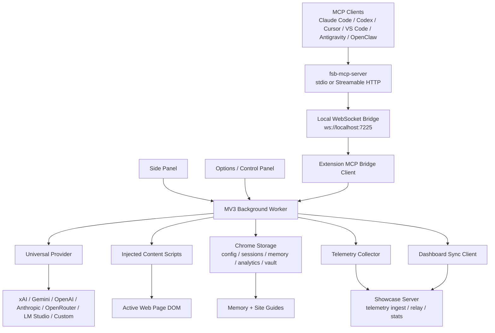

# FSB v0.9.72 Full Self Browsing

<div align="center">

<picture>
  <source media="(prefers-color-scheme: dark)" srcset="extension/assets/fsb_logo_dark.png" />
  <source media="(prefers-color-scheme: light)" srcset="extension/assets/fsb_logo_light.png" />
  
</picture>


**AI powered browser automation through natural language. Tell it what to do, and watch it browse for you.**

*Pure structural intelligence. Zero vision. Zero guessing.*

[Quick Start](#quick-start) · [MCP Server](#mcp-server) · [Architecture](#architecture) · [Providers](#ai-providers) · [Development](#development)

</div>

---

## Overview

FSB (Full Self Browsing) is an open source Chrome extension for AI powered browser automation. Describe a task in plain English and FSB reads the live DOM, builds a plan, executes browser actions, verifies results, and reports progress through the side panel or MCP.

> FSB v0.9.72 is functional and production ready for supervised automation. Browser automation can still behave unpredictably on complex or sensitive sites, so monitor actions and test on non critical pages first.

### Why DOM First

Project Mariner, Claude Computer Use, and OpenAI Operator rely heavily on visual page understanding. FSB uses page structure directly.

| Metric | Vision based agents | FSB |
|--------|---------------------|-----|
| Page understanding | Screenshots | DOM, selectors, ARIA, forms |
| Hidden elements | Often invisible | Available in structure |
| Typical per step latency | 1 to 3 seconds | 50 to 200 ms |
| Token/cost profile | Image heavy | Text/structure heavy |

### Quick Start TL;DR

**FSB shines when your AI client drives it directly.** Install the MCP server for your client of choice with one command. There are no manual config edits, and **no FSB API key is needed** because your MCP client's model handles the reasoning:

| Client | Install command |
|--------|---------------------|
| Claude Code | `npx -y fsb-mcp-server install --claude-code` |
| Claude Desktop | `npx -y fsb-mcp-server install --claude-desktop` |
| Cursor | `npx -y fsb-mcp-server install --cursor` |
| VS Code | `npx -y fsb-mcp-server install --vscode` |
| Antigravity | `npx -y fsb-mcp-server install --windsurf` |
| Codex | `npx -y fsb-mcp-server install --codex` |
| All at once | `npx -y fsb-mcp-server install --all` |

Preview before writing: append `--dry-run`. Sanity check with `npx -y fsb-mcp-server doctor`. Restart the client so the new MCP server appears.

**Then install the browser side** (the MCP bridge talks to the extension):

1. Get **FSB** from the [Chrome Web Store](https://chromewebstore.google.com/detail/badgafnfchcihdfnjneklogedcdkmjfk).
2. From your MCP client, try: `Search for cats on Google` or `Read this page and summarize it`.

Want to run FSB standalone from the extension side panel? Open settings, paste an API key for xAI, Gemini, OpenAI, Anthropic, OpenRouter, LM Studio, or a custom endpoint, then start there. MCP is optional.

**On OpenClaw?** Install FSB directly from [ClawHub](https://clawhub.ai/lakshmanturlapati/full-selfbrowsing). That is the fastest onboarding route. If you need the manual fallback, the FSB skill in [`skills/fsb/`](./skills/fsb/SKILL.md) still prints the canonical OpenClaw stdio config block and runs the doctor flow. The bare `--openclaw` install flag stays manual because OpenClaw's MCP config schema is unstable across builds.

**On Hermes?** Use the same skill at [`skills/fsb/`](./skills/fsb/SKILL.md). Run `node skills/fsb/scripts/print-hermes-yaml.mjs` to print the canonical `~/.hermes/config.yaml` `mcp_servers.fsb` block, or run `node skills/fsb/scripts/install-host.mjs` to detect a local Hermes config and gate the install on consent.

### What It Does

- Runs natural language browser tasks from the side panel.
- Supports xAI, Gemini, OpenAI, Anthropic, OpenRouter, LM Studio, and custom OpenAI compatible endpoints.
- Discovers live provider model lists and falls back to bundled defaults.
- Uses a 51 entry extension tool registry with 36 action tools and 15 read or lifecycle tools.
- Exposes 59 registered MCP handlers for external clients, including manual actions, read tools, autopilot, observability, vault, and compatibility stubs.
- Provides DOM snapshots, action verification, smart waiting, stuck detection, visual feedback, and session logs.
- Maintains long term memory for past sites, workflows, selectors, and task outcomes.
- Includes secure credential and payment vault flows for supervised autofill.
- Exposes a local MCP server so Claude Code, Codex, Cursor, VS Code, Antigravity, and other MCP clients can drive the browser.

Background agents are retired. Existing `chrome.storage.local['bgAgents']` data is preserved for users who had old agents, but scheduled or recurring automation is no longer an active FSB feature.

### Common Use Cases

- **QA and regression checks**: repeat page flows, click through states, fill forms, and collect action logs.
- **Research**: navigate pages, extract visible information, and summarize results without relying on screenshots.
- **Data entry**: move through structured forms with validation, dropdowns, custom controls, and table inputs.
- **Ecommerce**: compare product pages, inspect prices, monitor availability manually, and prepare carts under supervision.
- **Finance and dashboards**: read charts, tables, and current page state when a human remains in control.
- **Developer workflows**: drive GitHub, issue trackers, documentation sites, coding platforms, and browser-based tools.
- **Accessibility and DOM inspection**: expose structure, labels, selectors, forms, and hidden controls for debugging.

Short version: if you can do it in a browser, FSB can probably help you do it, repeat it, and show its work. It turns browser busywork into browse work, then goes beyond ordinary clicking with DOM structure, memory, verification, vault flows, and MCP agent control.

FSB is most reliable when the task can be expressed as page structure and user actions. It is intentionally not a stealth browser, scraper farm, or unsupervised account operator.

### Feature Detail

| Area | Current behavior |
|------|------------------|
| DOM analysis | Captures visible and structural page data, element refs, selectors, forms, ARIA labels, and DOM deltas. |
| Action execution | Supports clicks, typing, keys, scrolling, navigation, tabs, spreadsheet ranges, coordinate tools, and direct JavaScript. |
| Verification | Checks post-action state, loading behavior, DOM stability, and stuck-action repetition. |
| UI surfaces | Persistent side panel, options/control panel, logs, analytics, memory, vault, and sync controls. |
| Model support | Hosted providers, OpenRouter routing, LM Studio local models, custom endpoints, and live model discovery. |
| Output rendering | Markdown, sanitized HTML, Mermaid diagrams, Chart.js charts, and task progress messages. |
| Observability | Session history, action logs, token/cost accounting, diagnostics ring buffer, and MCP status probes. |
| Security | Encrypted keys, vault unlock flows, redaction helpers, DOMPurify, and restricted-tab recovery messaging. |

The core design goal is to keep the browser as the source of truth. The model receives structured page context, makes a tool decision, and the extension verifies what changed before moving to the next step.

---

## Repository Layout

| Path | Purpose |
|------|---------|
| [`extension/`](./extension/README.md) | Chrome extension package. Load this directory as an unpacked MV3 extension. |
| [`mcp/`](./mcp/README.md) | npm package `fsb-mcp-server`, the local MCP bridge for external AI clients. |
| [`skills/fsb/`](./skills/fsb/SKILL.md) | OpenClaw + Hermes skill: doctor + stdio/YAML printers + consent gated install for multiple hosts. |
| [`showcase/`](./showcase/README.md) | Marketing and dashboard site for full-selfbrowsing.com. Angular 20 static prerender + Express relay. |
| `showcase/server/` | Node/Express deploy backend for pairing, relay, auth, and dashboard data. |
| `server-py/` | Legacy Python/FastAPI-style backend prototype retained for reference. |
| `tests/` | Node tests for extension modules, MCP contracts, bridge behavior, and regression coverage. |
| `scripts/` | Repo maintenance and validation scripts. |

Top level deploy and validation files:

- `package.json` - root commands for validation, tests, packaging, and showcase helpers.
- `Dockerfile`, `fly.toml` - production deploy for the showcase server on fly.io.
- `.github/workflows/ci.yml` - validates extension, MCP smoke tests, and showcase build.
- `.github/workflows/deploy.yml` - deploys the production site on `main` pushes.

---

## Screenshots

<table>
<tr>
<td width="50%" align="center">

<br/><sub><b>Task Input</b></sub>
</td>
<td width="50%" align="center">

<br/><sub><b>Task Execution</b></sub>
</td>
</tr>
</table>

<details>
<summary><strong>More screenshots</strong></summary>

#### Dashboard and Analytics


#### API Configuration


#### Passwords Manager


#### Memory and Site Explorer


#### Intelligence Knowledge Graph


</details>

## Real Demos

The showcase About page includes real videos of FSB doing browser work across direct automation and MCP driven agent loops.

<table>
<tr>
<td width="50%" align="center">
<a href="https://www.youtube.com/watch?v=_iQ4_LSXcTU">

</a>
<br/><strong>FSB Ecommerce Autopilot by Grok 4.1</strong>
<br/><sub>A shopping workflow moving from instruction to browser actions.</sub>
</td>
<td width="50%" align="center">
<a href="https://www.youtube.com/watch?v=WbpOrFwgGME">

</a>
<br/><strong>Flight Booking Powered by Codex MCP</strong>
<br/><sub>Codex using FSB through MCP as the browser layer for a travel task.</sub>
</td>
</tr>
<tr>
<td width="50%" align="center">
<a href="https://www.youtube.com/watch?v=PNTGCWGopf8">

</a>
<br/><strong>OpenClaw Monitoring Doge Price</strong>
<br/><sub>OpenClaw providing the agent loop while FSB controls the live browser.</sub>
</td>
<td width="50%" align="center">
<a href="https://www.youtube.com/watch?v=mD9oGB2JqVM">

</a>
<br/><strong>An Aha Moment by Claude Opus 4.7</strong>
<br/><sub>Claude pairing reasoning with FSB browser execution and iteration.</sub>
</td>
</tr>
</table>

For stats nerds, the showcase also has [live project and usage charts](https://full-selfbrowsing.com/stats) with GitHub activity, active users, token flow, running agents, and popular MCP clients.

---

## Quick Start

### Prerequisites

- Chrome 88+ or another Chromium based browser such as Edge or Brave.
- One AI provider setup:
  - xAI API key: https://x.ai/api
  - Gemini API key: https://aistudio.google.com/app/apikey
  - OpenAI API key: https://platform.openai.com/api-keys
  - Anthropic API key: https://console.anthropic.com/account/keys
  - OpenRouter API key: https://openrouter.ai/keys
  - LM Studio local server running at `http://localhost:1234`
  - A custom OpenAI-compatible chat completions endpoint

### Install The Extension

Use the [Chrome Web Store listing](https://chromewebstore.google.com/detail/badgafnfchcihdfnjneklogedcdkmjfk) for normal installs. This is the recommended path because Chrome handles release updates automatically.

Use **Load unpacked** only for local development or when a breaking issue has been fixed in the repository and you need that fix before the Chrome Web Store listing updates. Loaded unpacked builds do not receive automatic release updates.

For local development or an urgent unreleased fix:

```bash
git clone https://github.com/fullselfbrowsing/FSB.git
cd FSB
```

1. Open `chrome://extensions/`.
2. Enable **Developer mode**.
3. Click **Load unpacked**.
4. Select the `extension/` directory.
5. Open the FSB side panel, open settings, configure a provider, and test the API connection.

Start with simple tasks such as:

- `Scroll down`
- `Search for cats on Google`
- `Click the first search result`
- `Read this page and summarize it`

Reload the extension from `chrome://extensions/` after local code changes. Reload open tabs after the extension reloads so content scripts re-inject.

### First Run Checklist

1. Open the FSB control panel from the extension.
2. Select a provider and model.
3. Enter the matching API key or local endpoint.
4. Use **Test API** to confirm the model can answer.
5. Open a normal webpage, not a browser-internal page.
6. Try a read-only task first, then a simple click or type task.
7. Keep the visual overlay enabled while evaluating behavior.

If a site uses heavy client rendering, custom canvas controls, or unusual shadow DOM, start by asking FSB to read the page and identify available controls. That gives the model a better first snapshot and makes failures easier to debug.

### Quick Troubleshooting

| Problem | Check |
|---------|-------|
| Extension does not appear | For Web Store installs, confirm FSB is enabled. For local development, confirm Chrome loaded `extension/`, not the repo root. |
| API test fails | Confirm the selected provider, key, endpoint, and model belong together. |
| Page reads fail | Move away from browser-internal pages such as `chrome://` or extension pages. |
| Clicks miss targets | Refresh the DOM snapshot, scroll the target into view, or use coordinate tools. |
| Typed text does not stick | Prefer `type_text` over JavaScript value assignment on controlled inputs. |
| MCP tools are missing | Restart the host client and run `fsb-mcp-server doctor`. |
| MCP tools time out | Check `status --watch`, active tab readiness, and whether another task is queued. |

Most failures are recoverable by inspecting the current page, refreshing selectors, or restarting the local MCP bridge. Reinstalling the MCP config should be the last step, not the first.

### Local Development Setup

You do not need a build step to load the extension in Chrome. You only need npm dependencies when running tests, building MCP, or building the showcase site.

```bash
npm install
npm --prefix mcp install
npm --prefix showcase/angular install
```

The extension reads bundled scripts directly from `extension/`. The MCP package is TypeScript and must be built before smoke tests or npm publishing. The showcase is a normal Angular app with static prerender output served by the production Express backend.

---

## MCP Server

FSB ships [`fsb-mcp-server`](https://www.npmjs.com/package/fsb-mcp-server), a local MCP server that lets external AI clients control the same browser extension. It exposes 59 registered handlers across manual browser control, read tools, autopilot, vault, observability, and visual session compatibility stubs.

The extension connects to the MCP bridge on:

```text
ws://localhost:7225
```

Optional Streamable HTTP mode exposes:

```text
http://127.0.0.1:7226/mcp
```

### One Command Install

```bash
npx -y fsb-mcp-server install --claude-desktop
npx -y fsb-mcp-server install --claude-code
npx -y fsb-mcp-server install --cursor
npx -y fsb-mcp-server install --vscode
npx -y fsb-mcp-server install --windsurf
npx -y fsb-mcp-server install --codex
npx -y fsb-mcp-server install --all
```

Preview without writing:

```bash
npx -y fsb-mcp-server install --all --dry-run
npx -y fsb-mcp-server install --list
```

### Manual Examples

Claude Code:

```bash
claude mcp add --scope user fsb -- npx -y fsb-mcp-server
```

Codex (`~/.codex/config.toml`):

```toml
[mcp_servers.fsb]
command = "npx"
args = ["-y", "fsb-mcp-server"]
```

VS Code (`mcp.json`):

```json
{
  "servers": {
    "fsb": {
      "type": "stdio",
      "command": "npx",
      "args": ["-y", "fsb-mcp-server"]
    }
  }
}
```

Diagnostics:

```bash
npx -y fsb-mcp-server doctor
npx -y fsb-mcp-server status --watch
npx -y fsb-mcp-server wait-for-extension
```

See [mcp/README.md](mcp/README.md) for the full tool reference and client-specific setup notes.

OpenCode uses a manual setup path. OpenClaw users should start with the direct [ClawHub install](https://clawhub.ai/lakshmanturlapati/full-selfbrowsing), then use the manual stdio fallback only when needed.

### MCP Usage Guidance

Manual tools are the default path for most external clients. They let the caller inspect the page, pick a selector, act, and verify. `run_task` is useful when the user explicitly wants FSB to run its own automation loop, but manual control is easier to audit and recover.

Recommended manual pattern:

1. Use `read_page` or `get_dom_snapshot` to understand the current page.
2. Choose the smallest action tool that can make the change.
3. Include `visual_reason` and `client` on every action tool call so the browser shows the trusted client badge.
4. Use `execute_js` for safe DOM reads and simple DOM triggered clicks.
5. Use native tools such as `click`, `type_text`, `press_key`, and `drag` when real browser events matter.
6. Verify with `read_page`, `get_page_snapshot`, or `get_dom_snapshot`.
7. Set `is_final: true` on the last action so the overlay clears immediately.

Use `doctor` and `status --watch` before changing client configs. Most MCP failures are connection, extension wake, active-tab, or content-script readiness issues, not install problems.

---

## Architecture



### Main Runtime Pieces

- **Background worker** (`extension/background.js`): owns sessions, model calls, tool execution, MCP routing, storage orchestration, telemetry flushing, and optional dashboard sync.
- **MCP bridge client** (`extension/ws/mcp-bridge-client.js` plus `extension/ws/mcp-tool-dispatcher.js`): keeps the extension connected to the local `fsb-mcp-server`, routes tool calls, records MCP metrics, and enforces tab ownership.
- **Content scripts** (`extension/content/`): analyze the DOM, create element references, execute actions, stream DOM state, wait for stable state, and render visual feedback.
- **AI layer** (`extension/ai/`): universal OpenAI-compatible request engine, provider settings, model discovery, tool definitions, transcripts, and action history.
- **Memory and site guides** (`extension/lib/memory/` plus `extension/site-guides/`): store prior task context and provide domain specific guidance.
- **Visualization** (`extension/lib/visualization/`): D3/site graph views for guide and memory exploration.
- **Vault** (`extension/config/secure-config.js` plus UI flows): encrypts API keys and saved user data in Chrome storage.
- **Telemetry and dashboard sync** (`extension/utils/telemetry-collector.js`, `extension/ws/ws-client.js`, and `showcase/server/`): send anonymous aggregate beats, relay paired dashboard sessions, and power the public stats page.
- **MCP package** (`mcp/`): TypeScript server that exposes stdio and optional Streamable HTTP, then translates MCP calls into extension bridge messages.

### Automation Flow

1. User or MCP client submits a task.
2. FSB captures the active page structure.
3. Relevant site guides and memory are retrieved.
4. The selected model plans the next tool call.
5. Content scripts execute browser actions and wait for visible change.
6. FSB verifies the result, records analytics, and either continues or finishes.

### State And Data Flow

FSB stores configuration and runtime data in Chrome storage. API keys and saved sensitive values go through the secure configuration layer. Session logs, analytics, and memory records are kept locally unless a user explicitly enables server sync or uses the showcase dashboard pairing flow.

During a task, the background worker owns the session state and talks to five main collaborators:

- content scripts for page reads and browser actions
- the selected provider for planning and response generation
- local storage for config, analytics, memory, vault records, and logs
- the local MCP bridge when an external client is driving the browser
- optional showcase services for paired dashboard sessions and anonymous aggregate stats

The MCP server does not replace the extension runtime. It is a local bridge that translates MCP requests into the same background-worker routes used by FSB's own UI.

### Browser Action Surface

The extension's canonical tool registry covers navigation, search, clicking, typing, keyboard events, scrolling, waiting, tabs, spreadsheets, coordinate interactions, DOM mutation helpers, read inspection, site guide lookup, memory search, and task finalization signals.

The MCP server exposes a curated public surface around that registry:

| Surface | Count | Examples |
|---------|-------|----------|
| Manual action tools | 36 | `execute_js`, `navigate`, `click`, `type_text`, `drag`, `set_attribute` |
| Read tools | 8 | `read_page`, `get_dom_snapshot`, `get_site_guide`, `read_sheet` |
| Autopilot | 3 | `run_task`, `stop_task`, `get_task_status` |
| Browser history helper | 1 | `back` |
| Visual session compatibility stubs | 2 | `start_visual_session`, `end_visual_session` return `TOOL_REMOVED` |
| Observability | 5 | `list_sessions`, `get_logs`, `search_memory` |
| Vault | 4 | `list_credentials`, `fill_credential`, `use_payment_method` |

Read tools bypass the mutation queue where safe. Mutation tools are serialized so two clients do not click, type, or navigate at the same time.

---

## AI Providers

FSB uses one universal provider path for hosted, routed, local, and custom OpenAI-compatible models.

| Provider | Default or fallback model | Notes |
|----------|---------------------------|-------|
| xAI | `grok-4-1-fast` | Default provider, fast automation profile. |
| Google Gemini | `gemini-2.5-flash` | Includes free/low cost model options depending on Google availability. |
| OpenAI | `gpt-4o` | Strong general automation and structured output. |
| Anthropic | `claude-sonnet-4-6` | Strong reasoning and form-heavy workflows. |
| OpenRouter | `openai/gpt-4o` | Single key for routed models; live discovery supported. |
| LM Studio | Live local model list | No API key; reads `/v1/models` from a local LM Studio server. |
| Custom | User supplied model | Any compatible chat completions endpoint. |

The extension includes 30 fallback model entries and live model discovery for supported hosted providers. Pricing and model availability change frequently, so use the provider dashboard as the source of truth for billing.

### Provider Configuration Notes

- xAI, Gemini, OpenAI, Anthropic, and OpenRouter use API keys saved in Chrome storage.
- LM Studio requires the local server to be enabled and reachable from Chrome.
- Custom endpoints should point to a chat completions-compatible URL.
- The saved model is preserved even when it is not in the bundled fallback list, so newly discovered models are not silently overwritten after a service worker restart.
- If discovery fails, the options page falls back to bundled models and shows the discovery status inline.

Provider-specific prompt formatting lives in the AI layer, but the execution loop is intentionally shared. That keeps action planning, tool validation, transcript storage, cost tracking, and error handling consistent across models.

### Model Discovery And Fallbacks

Model discovery queries provider model endpoints where available, filters non-text models, normalizes the list, and caches successful results. If a provider is offline, the key is missing, or discovery fails, FSB keeps the UI usable with bundled fallback models.

The fallback table currently includes:

- 6 xAI models
- 5 Gemini models
- 4 OpenAI models
- 9 Anthropic models
- 6 OpenRouter presets
- live-only LM Studio models

Custom providers are intentionally open-ended. The model name and endpoint come from user settings, and the universal provider handles OpenAI-compatible request/response behavior.

---

## Site Intelligence And Memory

FSB ships site guides for 17 categories, including ecommerce, finance, social, travel, coding, email, career, gaming, productivity, media, design, news, utilities, sports, reference, music, and games. Guides provide selectors, navigation patterns, workflow hints, and known site quirks.

Long term memory records:

- **Episodic**: what happened in a specific session.
- **Semantic**: facts learned about a domain or UI.
- **Procedural**: repeatable workflows and selectors that worked.

Memory operations are tracked separately from normal automation costs. The options dashboard exposes usage charts, memory detail panels, logs, and export controls.

### Guide Categories

| Category | Examples |
|----------|----------|
| Ecommerce | Amazon, eBay, Walmart, Best Buy, Target |
| Finance | Yahoo Finance, TradingView, Google Finance, Coinbase |
| Social | YouTube, Reddit, LinkedIn, Instagram, TikTok |
| Travel | Booking, Kayak, Google Travel, Airbnb, airlines |
| Coding | GitHub, Stack Overflow, LeetCode, Codeforces |
| Email and productivity | Gmail, Outlook, Google Workspace, Notion, Jira, Trello |
| Career | Workday, Greenhouse, Lever, major employer job portals |
| Media and design | Video players, voice recorders, Photopea, Miro, Excalidraw |
| Edge cases | CAPTCHA-like sliders, file upload, cookie opt-out, buried login links |

Site guides are helpers, not hard-coded scripts. FSB still reads the current DOM each turn and uses guides as context for better selectors and fewer repeated mistakes.

### Memory Lifecycle

After a task, FSB can extract memories from the session transcript and action history. Memories are scored, tagged, consolidated, and later retrieved by domain, task type, recency, and keyword relevance. This lets FSB reuse what it learned without stuffing every previous session into every prompt.

Memory and site maps are especially useful for:

- repeated workflows on the same domain
- pages with custom controls or unstable selectors
- identifying successful login, search, checkout, or form-fill patterns
- avoiding known bad selectors or repeated failed actions
- visualizing learned site structure from the options dashboard

---

## Security And Safety

- API keys are encrypted with AES-GCM and stored in Chrome storage.
- Credential and payment vault flows avoid sending raw secrets over the MCP bridge.
- Rendered chat output is sanitized with DOMPurify.
- Automation is scoped to the active session tab where possible.
- Logs can be reviewed or disabled for sensitive use cases.

Use separate API keys for development and production, rotate keys regularly, respect website terms of service, and supervise automation on anything account, finance, shopping, or data-entry related.

### Current Boundaries

- FSB does not bypass browser restrictions on internal pages.
- CAPTCHA solving support is a framework and optional service integration, not a guarantee.
- The extension can interact with the active page, tabs, and debugger-backed coordinate tools because those permissions are declared in the MV3 manifest.
- Saved credentials and payment methods require explicit user configuration and unlock flows.
- Automation should be treated like a fast assistant operating your browser, not like an unattended production worker.

### Data Handling

Provider calls receive the page/task context needed to complete the requested automation. That can include visible page text, form labels, selectors, and user-supplied task instructions. Avoid running automation on sensitive pages unless you are comfortable sending that task context to the selected model provider.

FSB does not require a hosted FSB account for local extension use. The showcase backend and dashboard pairing server are separate from normal local extension operation.

---

## Development

Install root dependencies when running validation or tests:

```bash
npm install
npm --prefix mcp install
npm --prefix showcase/angular install
```

Common checks:

```bash
npm run validate:extension
npm test
npm run test:mcp-smoke
npm --prefix showcase/angular run build
```

The CI workflow runs these checks in separate jobs:

- extension validation and Node tests
- MCP TypeScript build and smoke tests
- Angular showcase build

Other useful commands:

```bash
npm run showcase:serve
npm run showcase:smoke
npm --prefix mcp run build
npm --prefix mcp run dev
```

Debugging:

- Inspect the service worker from `chrome://extensions/`.
- Check the browser console on the active tab for content script logs.
- Use the options page log viewer for session and action history.
- For MCP issues, run `npm run test:mcp-smoke`, then `fsb-mcp-server doctor`, then `fsb-mcp-server status --watch`.

### Change Guidelines

- Keep behavior-specific docs close to the package that owns the behavior.
- Update the root README only for public setup, architecture, or feature changes.
- Update `mcp/README.md` when tool names, counts, transports, diagnostics, or installer platforms change.
- Update `extension/README.md` when manifest entry points, extension loading, packaging, or validation changes.
- Update `showcase/README.md` when Angular, deploy, crawler, or site build behavior changes.
- Prefer tests for any shared contract between the extension and MCP server; stale docs are usually symptoms of missing contract checks.

### Release Sanity Checks

Before cutting a release, verify:

- root `package.json` version matches `extension/manifest.json`
- `mcp/package.json` matches `mcp/src/version.ts`
- README version badges and "what's new" sections match package metadata
- screenshots and logos resolve from tracked paths
- MCP README tool counts match the registered runtime surface
- showcase README matches Angular major version and build output path
- no retired background-agent behavior is advertised as active functionality

### Documentation Ownership

The root README should describe what a new user needs to understand before installing, testing, or choosing an integration path. Detailed package behavior belongs in the package README that owns it. This split keeps the public overview useful while still giving maintainers a clear place to update tool surfaces, extension entry points, or showcase deploy instructions.

---

## License

This project is licensed under the Business Source License 1.1. See [LICENSE](LICENSE).

## Support And Contributing

- Report bugs and feature requests in [GitHub Issues](https://github.com/fullselfbrowsing/FSB/issues).
- Include the task prompt, target site, provider/model, logs, and reproduction steps where possible.
- Pull requests should update tests and docs when behavior, setup, or public interfaces change.

<div align="center">

**Made by [Lakshman Turlapati](https://github.com/lakshmanturlapati)**

*FSB Full Self Browsing: AI powered automation, accessible to everyone.*

</div>
