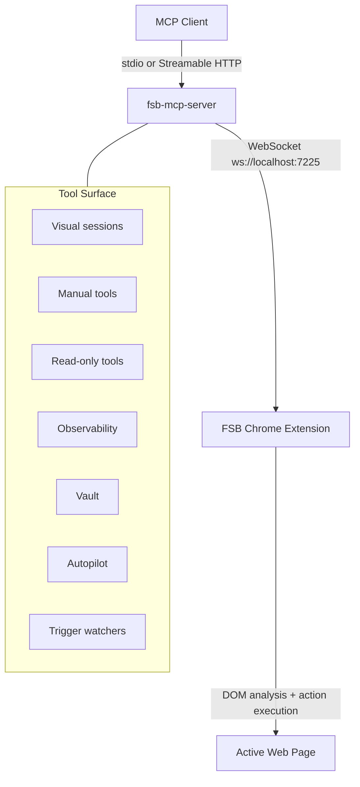

# FSB MCP Server

<div align="center">

<picture>
  <source media="(prefers-color-scheme: dark)" srcset="https://raw.githubusercontent.com/LakshmanTurlapati/FSB/main/extension/assets/fsb_logo_dark.png" />
  <source media="(prefers-color-scheme: light)" srcset="https://raw.githubusercontent.com/LakshmanTurlapati/FSB/main/extension/assets/fsb_logo_light.png" />
  
</picture>


[](https://www.npmjs.com/package/fsb-mcp-server)


**Control your browser from any MCP client.**

*Manual browser tools, trigger watchers, visual sessions, autopilot, vault, and observability for the FSB Chrome Extension.*

[Quick Start](#quick-start) · [Trigger Watchers](#trigger-watchers) · [Tools](#tools-63-total) · [Diagnostics](#diagnostics) · [Architecture](#architecture)

</div>

---

## What It Is

`fsb-mcp-server` connects MCP clients such as Claude Desktop, Claude Code, Codex, Cursor, VS Code, Windsurf, Zed, Cline, Gemini CLI, Continue, and others to the FSB Chrome extension.

The server supports two operating styles:

- **Manual mode**: the MCP client chooses each step with tools such as `navigate`, `read_page`, `get_dom_snapshot`, `click`, `type_text`, `execute_js`, and `scroll`.
- **Autopilot mode**: the MCP client calls `run_task`, and FSB's built-in AI loop decides the browser steps.

It also supports trigger watchers, visible client-owned visual sessions, vault autofill tools, session logs, memory search, and diagnostic commands.

Use this package when you want your AI client to drive the browser directly while still using FSB's DOM analysis, selector handling, visual overlay, action verification, session logging, memory, and vault boundaries.

> **PhantomStream (FSB v0.12.0):** the dashboard live-preview and remote-control relay are now powered by the published `@full-self-browsing/phantom-stream` package on the extension and showcase side. This is an internal capture/renderer/transport change — the MCP tool schemas, routes, and bridge contracts in this server are unchanged.

### What's New In v0.10.0

This is the trigger watchers release. Full details live in `CHANGELOG.md`.

- New MCP tools: `trigger`, `stop_trigger`, `get_trigger_status`, and `list_triggers`.
- `trigger` watches one selector and condition in the caller's owned tab. It defaults to blocking mode with 30s progress heartbeats, a 120s timeout, and a 240s safety auto-detach ceiling.
- `detached:true` returns immediately with a `trigger_id`; callers can poll with `get_trigger_status`, list with `list_triggers`, or cancel with `stop_trigger`.
- Watch modes: `live-observe` uses in-page mutation observation without reload; `refresh-poll` reloads the owned tab in the background and coalesces same-tab due watches into one reload.
- `rearm_on_fire:true` keeps a watch armed after fire, with hysteresis for numeric conditions. Default behavior remains fire once.
- Trigger output is notify-only to the caller. FSB does not send desktop/browser/email/SMS/Slack push notifications and does not run auto-act workflows.

### What's New In v0.8.0

This is the FSB v0.9.60 milestone release. The headline change is the new multi-agent tab concurrency contract; full details live in `CHANGELOG.md`.

- Multi-agent tab concurrency: per-session/task `agent_id` is FSB-issued (`crypto.randomUUID()`); MCP callers do not supply it.
- Tab-ownership enforcement on every MCP tool dispatch. Cross-agent calls reject with `TAB_NOT_OWNED`. Incognito tabs reject with `TAB_INCOGNITO_NOT_SUPPORTED`. Cross-window tabs reject with `TAB_OUT_OF_SCOPE`.
- Configurable concurrency cap (default 8, range 1-64) persisted in `chrome.storage.local`. The (N+1)th claim rejects with `AGENT_CAP_REACHED { cap, active }`.
- Per-bindTab `ownership_token` (fresh `crypto.randomUUID()` per binding) prevents tab-ID-reuse exploitation when Chrome recycles a closed tab's ID.
- Forced-new-tab pooling via `chrome.tabs.onCreated + openerTabId`: opening a forced-new tab does not consume a cap slot.
- Lock release on task or session end, MCP client disconnect (after a 10s reconnect grace keyed by `connection_id`), or user closing the tab. There is no idle timeout.
- Service-worker eviction recovery: agent registry mirrors to `chrome.storage.session` write-through; on SW wake, `hydrate()` reconciles persisted records against `chrome.tabs.query()` and reaps ghost records.
- New `back` MCP tool: ownership-gated, single-step browser-history back. Returns one of five typed status codes: `ok`, `no_history`, `cross_origin`, `bf_cache`, `fragment_only`.
- `run_task` now returns when the underlying automation actually completes (Phase 236 reborn). The 300s ceiling has been raised to a 600s safety net at both the server and the bridge.
- 30s heartbeat ticks emitted via `notifications/progress` with rich fields under `params._meta` (`alive`, `step`, `elapsed_ms`, `current_url`, `ai_cycles`, `last_action`). MCP host clients no longer hit per-tool timeouts on long automations.
- Task lifecycle persisted in `chrome.storage.session` keyed by `task_id`. On SW eviction the server emits a `partial_outcome` with `disposition: 'sw_evicted'` if the bridge cannot recover.
- Background-tab execution: most tools no longer steal focus. Only tools that genuinely require focus opt in via the per-tool `_forceForeground` flag in `tool-definitions.js`. Today only `switch_tab` opts in.
- UI: page overlay badge appends a short `agent_id` suffix; sidepanel and popup show a read-only "owned by Agent X" chip on owned tabs.
- Dependencies: `@modelcontextprotocol/sdk` `^1.27.1` -> `^1.29.0`. Zod stays on `^3.x`.

### What's New In v0.7.4

- Bridge lifecycle reconnect across service worker wakes.
- Hub/relay coordination for multiple MCP server instances.
- Route-aware tool dispatch and centralized parameter mapping.
- Layered diagnostics through `doctor` and `status --watch`.
- Persistent visual session glow across content script reinjection.
- Secure vault tools that avoid sending raw secrets over the bridge.
- One-command installer coverage for 21 platforms.

Background-agent MCP tools were retired with the extension's background-agent sunset. The agent registrar now only exposes `back` for ownership-gated history navigation.

---

## Supported Clients

The installer knows about 21 platform targets. Some are file-based, some delegate to a native CLI, and some print manual instructions when the host does not expose a safe config file.

Common file or CLI targets:

| Flag | Client |
|------|--------|
| `--claude-desktop` | Claude Desktop |
| `--claude-code` | Claude Code |
| `--cursor` | Cursor |
| `--vscode` | VS Code |
| `--windsurf` | Windsurf |
| `--cline` | Cline |
| `--zed` | Zed |
| `--codex` | Codex CLI / Codex IDE |
| `--gemini` | Gemini CLI |
| `--continue` | Continue |
| `--roo-code` | Roo Code |
| `--kilo-code` | Kilo Code |
| `--goose` | Goose |
| `--amazon-q` | Amazon Q |
| `--amp` | Amp |
| `--boltai` | BoltAI |
| `--opencode` | OpenCode |

Instruction-only or UI-driven targets include JetBrains, ChatGPT, Claude.ai, and Warp. Run `install --list` to see the current registry, config paths, and detection status on your machine.

### OpenClaw

The canonical OpenClaw onboarding path is the FSB skill at `skills/FSB Skill/` in the repo root. Loading the skill into a fresh OpenClaw runs the doctor flow, prints the canonical OpenClaw stdio config block for the user to paste into OpenClaw's MCP config, and offers consent-gated install for any other MCP hosts detected on the same machine. The bare `--openclaw` install flag in this CLI stays manual / unsupported because OpenClaw's MCP config schema is still unstable across builds; the skill prints and the user pastes, never auto-writes the OpenClaw config.

To build a reproducible publish artifact for ClawHub, run `npm run package:skill` from the repo root. It zips `skills/FSB Skill/` into `dist/skill/FSB-Skill-<version>.zip` (version stamped from `SKILL.md` frontmatter). Publishing is user-gated: `clawhub login` and then `clawhub publish "skills/FSB Skill"`. See `.planning/v0.9.61-CLAWHUB-PUBLISH-QA.md` for the pre-publish QA checklist.

### Installer Behavior

The installer writes the smallest config entry needed for the selected platform:

```text
command: npx
args: -y fsb-mcp-server
```

For file-based targets, existing config files are parsed, updated, and serialized back in the platform's expected format: JSON, JSONC, TOML, or YAML. For Claude Code, the installer delegates to the `claude mcp add --scope user` CLI command. For instruction-only targets, it prints steps instead of guessing at a private config path.

Use `--dry-run` before `--all` when you want to see planned writes without changing files.

---

## Prerequisites

- Node.js 18+
- FSB Chrome extension installed and active
- A normal webpage open in Chrome for page-reading and interaction tools

Chrome internal pages such as `chrome://extensions` cannot be controlled by content scripts. Use `list_tabs`, `navigate`, or `open_tab` to move back to a normal page.

---

## Quick Start

FSB uses two local endpoints:

| Endpoint | Purpose |
|----------|---------|
| `ws://localhost:7225` | Extension bridge. The browser extension connects here. |
| `http://127.0.0.1:7226/mcp` | Optional Streamable HTTP MCP endpoint for clients that support it. |

The extension pairing contract did not change in `0.7.4`. Streamable HTTP is an additional client entrypoint; the extension still talks to the local WebSocket bridge.

### One Command Install

```bash
npx -y fsb-mcp-server install --claude-desktop
npx -y fsb-mcp-server install --claude-code
npx -y fsb-mcp-server install --cursor
npx -y fsb-mcp-server install --vscode
npx -y fsb-mcp-server install --windsurf
npx -y fsb-mcp-server install --codex
npx -y fsb-mcp-server install --all
```

Useful installer commands:

```bash
npx -y fsb-mcp-server install --list
npx -y fsb-mcp-server install --all --dry-run
npx -y fsb-mcp-server uninstall --cursor
```

`install --list` shows all supported platform flags and whether the target config was detected.

### Manual Setup

Claude Code:

```bash
claude mcp add --scope user fsb -- npx -y fsb-mcp-server
```

Codex CLI / Codex IDE (`~/.codex/config.toml`):

```toml
[mcp_servers.fsb]
command = "npx"
args = ["-y", "fsb-mcp-server"]
```

Claude Desktop, Cursor (`~/.cursor/mcp.json`), and most JSON-based clients:

```json
{
  "mcpServers": {
    "fsb": {
      "command": "npx",
      "args": ["-y", "fsb-mcp-server"]
    }
  }
}
```

VS Code uses the `servers` root key and requires `type: "stdio"`:

```json
{
  "servers": {
    "fsb": {
      "type": "stdio",
      "command": "npx",
      "args": ["-y", "fsb-mcp-server"]
    }
  }
}
```

After editing config files, restart or reload the host client if tools do not appear. Claude Code is usually active immediately after `claude mcp add`; Cursor, Claude Desktop, VS Code, and Windsurf often need a restart, refresh, or trust/start action in their MCP UI.

### Local Streamable HTTP

```bash
npx -y fsb-mcp-server serve
```

Default endpoint:

```text
http://127.0.0.1:7226/mcp
```

Health check:

```text
http://127.0.0.1:7226/health
```

---

## Diagnostics

Start with diagnostics before reinstalling:

```bash
npx -y fsb-mcp-server doctor
npx -y fsb-mcp-server status
npx -y fsb-mcp-server status --watch
npx -y fsb-mcp-server wait-for-extension
```

Recommended release or host smoke flow:

```bash
npm run test:mcp-smoke
npx -y fsb-mcp-server doctor
npx -y fsb-mcp-server status --watch
```

`doctor` reports the primary failing layer: package, bridge, extension, active tab, content script, or configuration. Only restart or reinstall the client when the reported layer points there.

### Common Failure Modes

| Symptom | First check |
|---------|-------------|
| No tools in client | Confirm the client config and restart/reload the host. |
| Tools exist but all calls fail | Run `doctor` and confirm the extension is connected. |
| Page reads fail | Make sure the active tab is a normal webpage, not `chrome://`, `edge://`, or the web store. |
| Clicks do nothing | Refresh DOM refs with `get_dom_snapshot`, then try `click_at` or `execute_js` where appropriate. |
| A task is stuck | Use `get_task_status`, then `stop_task` if it is still running. |
| Visual overlay remains | Send the last action with `is_final:true`, wait for the 60s idle auto-clear, or reload the tab. |

For local development, run `npm --prefix mcp run build` after TypeScript changes. The root `npm run test:mcp-smoke` command builds the MCP package before exercising lifecycle and tool smoke tests.

### Restricted Tabs

Chrome blocks content script injection on browser-internal pages and some privileged surfaces. When that happens, page-reading and interaction tools will report a restricted-tab recovery message instead of pretending the page is empty.

Safe recovery tools usually include:

- `list_tabs`
- `open_tab`
- `switch_tab`
- `navigate`
- `go_back`
- `go_forward`
- `refresh`

Move to a normal `http` or `https` page before calling DOM tools such as `read_page`, `get_dom_snapshot`, or `click`.

---

## Visual Session Lifecycle

> **v0.9.0 breaking change** -- The explicit `start_visual_session` and `end_visual_session` tools were REMOVED in v0.9.0. Action tools now require `visual_reason` + `client` fields; the visual session is created implicitly on the first action call, refreshed on a sliding 60-second window, and cleared by `is_final: true` (immediate) or 60 seconds of silence (auto-clear). Calling the removed tools returns the typed `TOOL_REMOVED` error. See [CHANGELOG.md](./CHANGELOG.md#v0.9.0) for the migration recipe with concrete before/after code.

Use the implicit visual session when your MCP client controls the browser and you still want FSB's visible trusted overlay. The session is per-tab and per-agent; the v0.9.60 ownership gate (`TAB_NOT_OWNED`) fires before any session state is touched.

1. Call any action tool (`click`, `type_text`, `navigate`, ...) with the required field bundle: `visual_reason` (short human-readable string for the overlay) and `client` (allowlisted badge label such as `Codex`, `Claude`, `ChatGPT`, `Gemini`, `Cursor`, `Windsurf`, `OpenCode`, `OpenClaw`, `Grok`, `Perplexity`, or `Antigravity`).
2. Drive the page with subsequent action tools. Each call re-arms the 60-second sliding window so the overlay stays alive as long as actions keep arriving.
3. On the LAST action of the task, set `is_final: true`. The overlay clears immediately after the action's `change_report` resolves -- no 60-second wait.

Example:

```text
navigate(url="https://example.com/cart", visual_reason="Complete checkout", client="Codex")
click(selector="text=Checkout", visual_reason="Complete checkout", client="Codex")
type_text(selector="#email", text="user@example.com", visual_reason="Complete checkout", client="Codex", is_final=true)
```

If the task ends without an explicit `is_final: true` signal, the overlay auto-clears after 60 seconds of no further carrying action calls. Read-only tools (`read_page`, `get_dom_snapshot`, `get_text`, ...) do NOT carry the field bundle and do NOT re-arm the sliding window -- reads stay silent by design.

Calling the removed `start_visual_session` or `end_visual_session` tools by name returns the typed `TOOL_REMOVED` error whose body names the new contract and points at this CHANGELOG entry. See `mcp/CHANGELOG.md` v0.9.0 for the full migration recipe and the typed-error catalogue (`VISUAL_FIELDS_REQUIRED`, `BADGE_NOT_ALLOWED`, `TOOL_REMOVED`).

Use `run_task` only when the user explicitly wants FSB autopilot to decide and execute the steps -- autopilot manages its own overlay lifecycle internally and is NOT affected by the v0.9.0 implicit-contract change.

### Manual Tool Selection

For most browser work, start read-only and then choose the smallest mutating tool:

- Use `read_page` when text is enough.
- Use `get_dom_snapshot` when selectors, inputs, forms, buttons, and refs matter.
- Use `get_page_snapshot` when an agent needs a compact planning view.
- Use `get_site_guide` when a site has known workflow quirks or selectors.
- Use `execute_js` for robust DOM reads and simple DOM-triggered actions.
- Use native tools such as `type_text`, `press_key`, `click`, and `drag` when frameworks need real events.
- Use coordinate tools for canvas, maps, overlays, and controls that do not expose useful DOM selectors.

Manual mode keeps the external AI client in control. Autopilot mode delegates control to FSB's internal loop and is better for user requests that explicitly say to let FSB run the task.

### Queueing Model

Mutation tools are serialized through a task queue. This prevents overlapping browser actions when multiple clients or repeated calls arrive close together. Read-only tools can bypass the queue where safe, allowing status or page inspection while a longer mutation is running.

Longer-running tools have timeout overrides. For example, spreadsheet operations can take more time than a normal click because they may type many cells. Autopilot also has a longer timeout because it runs multiple turns inside the extension.

---

## Trigger Watchers

Trigger Watchers let an MCP caller watch one DOM element and condition while keeping the browser as the source of truth. They are useful for prices, availability text, counters, queue states, and other page values that should fire when a visible or extracted value changes.

| Tool | Purpose |
|------|---------|
| `trigger` | Arm one selector plus condition on the caller's owned tab. |
| `stop_trigger` | Cancel a watch and clear its lifecycle work. |
| `get_trigger_status` | Read one watch snapshot, including current status and last event. |
| `list_triggers` | List visible watches, defaulting to active and attention states. |

Use `live-observe` when the page updates in place and you do not want a reload. It uses an in-page observer plus pulse feedback. Use `refresh-poll` when the value only changes after reload; FSB reloads the owned tab in the background by tab id, waits for readiness, reads the selector, and evaluates the condition. Same-tab due refresh-poll watches share one reload per batch, while watches on other tabs reload independently.

`trigger` defaults to blocking mode. The MCP server pre-generates a `trigger_id`, emits 30s progress heartbeats while waiting, uses a 120s default timeout, and auto-detaches at a 240s safety ceiling. Pass `detached:true` to return immediately and poll later with `get_trigger_status` or `list_triggers`. Outcomes include `fired`, `timed_out`, `detached`, and typed errors.

Default trigger behavior is fire-once. Pass `rearm_on_fire:true` to keep the watch armed after a fire; numeric threshold and percent-change conditions use hysteresis so a rearmed trigger does not repeatedly fire on the same satisfied edge. Snapshots also clean up on timeout, TTL expiry, tab close, explicit stop, and owner release after reconnect grace.

Trigger Watchers are local and session-bound. Chrome and the FSB extension must stay open and connected; this is not server-side monitoring and it does not resume across browser restart. Results are notify-only to the MCP caller: FSB reports the event, and the caller decides whether to act. There is no desktop/browser/email/SMS/Slack push delivery and no auto-act-on-fire workflow engine.

Restricted pages such as `chrome://` surfaces cannot be watched by content scripts. Those cases report structured blocked-page attention (`TRIGGER_PAGE_BLOCKED`) instead of staging page text. A tab cannot have active `live-observe` and `refresh-poll` watches at the same time; the opposite-mode request returns `TRIGGER_TAB_WATCH_CONFLICT`. Same-mode co-location is allowed.

The extension enforces trigger concurrency with `fsbTriggerCap`, configurable in the control panel. Default is `8`, range is `1..64`. Active usage includes armed watches plus attention states such as `needs_attention` and `blocked`; terminal states such as `fired`, `timed_out`, and `stopped` do not count as active cap usage.

---

## Multi-Agent Contract (v0.8.0)

Starting with `0.8.0`, FSB supports multiple concurrent MCP agents driving distinct tabs in the same Chrome profile. The contract is enforced inside the extension; MCP clients only need to know the rules.

### Agent identity

- `agent_id` is required but server-issued. The FSB extension mints it via `crypto.randomUUID()` and captures it through the `agent:register` bridge route on first tool dispatch. MCP clients do not pass `agent_id` themselves; if they try, the server ignores the supplied value and uses its own.
- `tab_id` is agent-scoped. Once an agent claims a tab, only that agent can address it. The mapping is per-bindTab and rebinding mints a fresh `ownership_token`, so a tab ID that Chrome later recycles cannot be hijacked by another agent.
- A `connection_id` is minted at every WebSocket `onopen` and reflected on `agent:register` responses. It is the correlation key for the 10s reconnect grace window.

### Concurrency cap

- The extension enforces a configurable cap on the number of concurrent agents. Default is `8`, range is `1-64`. The current value is persisted in `chrome.storage.local` under the key `fsbAgentCap` and exposed in `control_panel.html` (Advanced Settings) as the Agent Concurrency card.
- The (N+1)th agent claim rejects with the typed error `AGENT_CAP_REACHED { cap, active }`.
- Forced-new-tab pooling: a tab opened with `openerTabId` set to an existing agent's tab joins that agent's pool and does not consume an additional cap slot.

### Ownership enforcement

Every MCP tool dispatch passes through the gate in `extension/ws/mcp-tool-dispatcher.js`. Cross-boundary calls reject with typed errors:

| Error code | Condition |
|------------|-----------|
| `TAB_NOT_OWNED` | The calling agent does not own the target tab. |
| `TAB_INCOGNITO_NOT_SUPPORTED` | The target tab is in an incognito window. |
| `TAB_OUT_OF_SCOPE` | The target tab is in a window the calling agent has not bound. |

### Lock release

An agent's tab lock releases on any of:

- The driving task or visual session ends.
- The MCP client disconnects and does not reconnect within the 10s `RECONNECT_GRACE_MS` window keyed by `connection_id`.
- The user closes the tab (`chrome.tabs.onRemoved`).

There is no idle timeout. An idle agent keeps its tab indefinitely until one of the events above occurs.

### Resilience: heartbeat + persistence + sw_evicted recovery

- `run_task` emits a 30s heartbeat via `notifications/progress`. Each tick carries rich fields under `params._meta`: `alive`, `step`, `elapsed_ms`, `current_url`, `ai_cycles`, `last_action`. Long automations no longer trip per-tool timeouts in MCP host clients.
- Task lifecycle is persisted in `chrome.storage.session` keyed by `task_id`. On service-worker eviction during a long task, the bridge reconciles in-flight tasks on reconnect.
- If the bridge cannot recover after eviction, the server resolves `run_task` with a structured `partial_outcome` whose `disposition` is `'sw_evicted'`. The hint string is the literal `lifecycle event missing -- audit cleanup paths`.
- The agent registry mirrors to `chrome.storage.session` write-through; on SW wake, `hydrate()` reconciles persisted records against `chrome.tabs.query()` and reaps ghost records before servicing any request.

### `back` tool

The new ownership-gated `back` tool is the typed replacement for `execute_js("history.back()")`. It returns:

```text
{ status, resultingUrl, historyDepth }
```

where `status` is one of `ok`, `no_history`, `cross_origin`, `bf_cache`, `fragment_only`. Settle verification uses `pageshow` with a 2s timeout; cross-origin transitions reuse the v0.9.11 BF-cache resilience path to re-inject the content script. The tool is background-tab compatible and does not steal focus.

### Background-tab execution

Most tools execute on background tabs without stealing focus. Tools that genuinely require focus opt in via the per-tool `_forceForeground` flag in `extension/ai/tool-definitions.js`. As of `0.8.0`, only `switch_tab` opts in. The dispatcher gate lives in both `extension/ws/mcp-tool-dispatcher.js` (`handleSwitchTabRoute`) and `extension/ai/tool-executor.js` (`case 'switch_tab'`).

---

## Tools (63 Total)

### Visual Sessions (2)

| Tool | Purpose |
|------|---------|
| `start_visual_session` | Removed in v0.9.0 -- see Visual Session Lifecycle section. Calling returns `TOOL_REMOVED`. |
| `end_visual_session` | Removed in v0.9.0 -- see Visual Session Lifecycle section. Calling returns `TOOL_REMOVED`. |

### Autopilot And Agent Navigation (4)

| Tool | Purpose |
|------|---------|
| `run_task` | Let FSB's AI perform a natural language browser task end to end. |
| `stop_task` | Cancel the active automation task. |
| `get_task_status` | Check task progress, phase, and ETA. |
| `back` | Single-step browser-history back, ownership-gated. Returns `{ status, resultingUrl, historyDepth }`. |

### Trigger Watchers (4)

| Tool | Purpose |
|------|---------|
| `trigger` | Arm a one-element watch with blocking or detached reporting. |
| `stop_trigger` | Stop an armed or attention-state trigger. |
| `get_trigger_status` | Read one trigger snapshot and latest event. |
| `list_triggers` | List visible triggers, defaulting to active and attention states. |

### Manual Browser Control (36)

| Group | Tools |
|-------|-------|
| Power | `execute_js` |
| Navigation | `navigate`, `search`, `go_back`, `go_forward`, `refresh` |
| Interaction | `click`, `type_text`, `press_enter`, `press_key`, `select_option`, `check_box`, `hover`, `right_click`, `double_click`, `select_text_range`, `drag_drop`, `drop_file`, `focus`, `clear_input` |
| Scrolling | `scroll`, `scroll_to_top`, `scroll_to_bottom`, `scroll_to_element` |
| Tabs | `open_tab`, `switch_tab`, `close_tab` |
| Spreadsheets | `fill_sheet` |
| Coordinates and mutation | `click_at`, `click_and_hold`, `drag`, `drag_variable_speed`, `scroll_at`, `insert_text`, `double_click_at`, `set_attribute` |

Notes:

- `execute_js` is powerful but should still be verified with a read-only tool after it changes page state.
- `type_text` is preferred over setting `.value` manually for React, Angular, Vue, and similar controlled inputs.
- `select_option` only targets native `<select>` elements; use click patterns for custom dropdowns.
- `fill_sheet` can take longer than normal tools and uses a longer timeout.

### Read Only (8)

| Tool | Purpose |
|------|---------|
| `read_page` | Read visible page text. |
| `get_text` | Read text from a selected element. |
| `get_attribute` | Read an attribute from a selected element. |
| `get_dom_snapshot` | Get structured DOM elements, refs, selectors, and forms. |
| `get_page_snapshot` | Get a compact page snapshot for agent planning. |
| `get_site_guide` | Retrieve site-specific automation guidance. |
| `list_tabs` | List open tabs. |
| `read_sheet` | Read spreadsheet ranges. |

### Observability (5)

| Tool | Purpose |
|------|---------|
| `list_sessions` | List past automation sessions. |
| `get_session_detail` | Inspect a specific session. |
| `get_logs` | Read recent or session-scoped logs. |
| `search_memory` | Search FSB memory for relevant past experience. |
| `get_memory_stats` | Inspect memory counts and storage usage. |

### Vault (4)

| Tool | Purpose |
|------|---------|
| `list_credentials` | List saved credential metadata without passwords. |
| `fill_credential` | Fill a login form with an unlocked saved credential. |
| `list_payment_methods` | List saved payment metadata without full card data. |
| `use_payment_method` | Fill checkout data after user confirmation. |

Vault responses expose metadata only. Passwords, full card numbers, and CVV values are resolved inside the extension and are not returned to the MCP client.

### Tool Count Contract

The public count is intentionally based on registered MCP handlers, not every internal helper in the extension. The extension's canonical registry also contains task-lifecycle signals and internal context tools used by the browser runtime. The MCP README documents the tool surface an MCP client can call.

---

## Architecture



Multiple MCP clients can connect at once. The first server instance becomes the hub on port 7225; later instances become relay clients. If the hub exits, a relay can promote to hub.

The server also exposes live resources:

| Resource | URI |
|----------|-----|
| Current Page DOM | `browser://dom/snapshot` |
| Open Tabs | `browser://tabs` |
| Site Guides | `fsb://site-guides` |
| FSB Memory | `fsb://memory` |
| Extension Config | `fsb://config` |

Resources are read-only views intended to help agents understand the browser state without issuing an action. They are complementary to tools; they do not replace the tool calls needed for navigation or interaction.

---

## Development

From the repo root:

```bash
npm --prefix mcp install
npm --prefix mcp run build
npm run test:mcp-smoke
```

Useful package commands:

```bash
npm --prefix mcp run dev
npm --prefix mcp run doctor
npm --prefix mcp run status
npm --prefix mcp run serve
```

Release checks should verify:

- `mcp/src/version.ts` and `mcp/package.json` agree.
- `mcp/README.md` tool counts match the registered runtime surface.
- `mcp/src/tools/schema-bridge.ts` still loads the generated `ai/tool-definitions.cjs`.
- Root tests still cover route contracts and setup guidance.
- The npm package includes `build/`, `ai/`, `README.md`, and `server.json`.

### Package Contents

The npm package publishes built JavaScript from `build/`, the copied CommonJS tool definitions under `ai/`, package metadata, `server.json`, and this README. The TypeScript source remains in the repository.

The build command copies `extension/ai/tool-definitions.js` into `mcp/ai/tool-definitions.cjs`. That keeps the MCP server aligned with the extension action registry without duplicating schemas by hand.

### Versioning

The MCP package has its own version (`0.10.0`) because it is published independently from the extension release (`0.9.90`). When extension bridge contracts change, update both the MCP version metadata and the compatibility notes in this README. When only website or extension UI text changes, the MCP version usually does not need to move.

Contract-sensitive changes should be covered by tests before publishing:

- route names and bridge message types
- parameter transforms between MCP names and FSB internal action names
- installer platform config writers
- restricted-tab recovery messages
- visual-session token lifecycle
- vault redaction boundaries
- multi-agent contract: `agent_id` capture, ownership gate, configurable cap, ownership tokens, `back` tool
- trigger contract: `trigger`, `stop_trigger`, `get_trigger_status`, `list_triggers`, blocking/detached reporting, and local browser-open limits

### Releasing 0.10.0

This 0.10.0 build is release-prep ready. The actual `npm publish` is a USER action via the existing tag-driven release workflow; autonomous mode does not run it.

To publish:

- Preferred: run the user's tag-driven release workflow (`git tag v0.10.0 && git push origin v0.10.0`); the workflow handles `npm publish` from a clean working tree.
- Manual fallback: from the release branch, `cd mcp && npm publish` after confirming `npm whoami`, `npm --prefix mcp run build` exit 0, and the MCP smoke/parity/schema gates exit 0.

Do not run `npm publish` from autonomous mode.

---

## Links

- [FSB Chrome Extension](https://github.com/LakshmanTurlapati/FSB)
- [npm package](https://www.npmjs.com/package/fsb-mcp-server)
- [Issues](https://github.com/LakshmanTurlapati/FSB/issues)
- [License](https://github.com/LakshmanTurlapati/FSB/blob/main/LICENSE)

<div align="center">

*Built by [Lakshman Turlapati](https://github.com/LakshmanTurlapati)*

</div>
